# 二、cocos creator 基础

## 2.1 下载软件并调整配置

1. 进入[Cocos Creator官网](https://docs.cocos.com/creator/3.8/manual/zh/)

2. 选择新手上路

    - 下载

    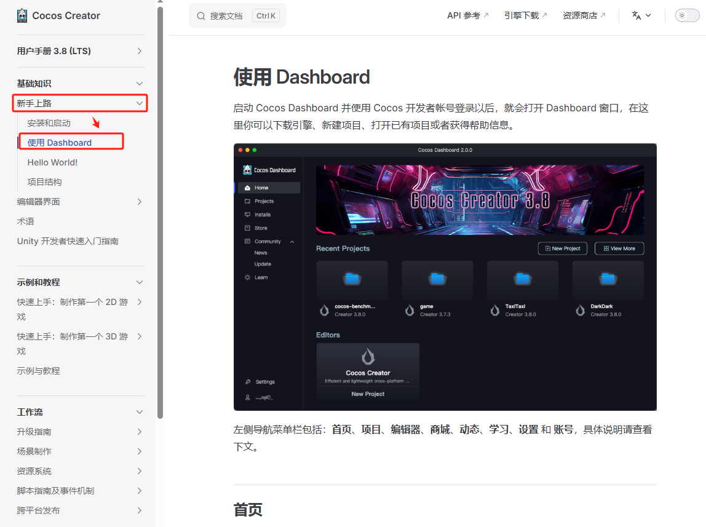

    - 设置下载目录

    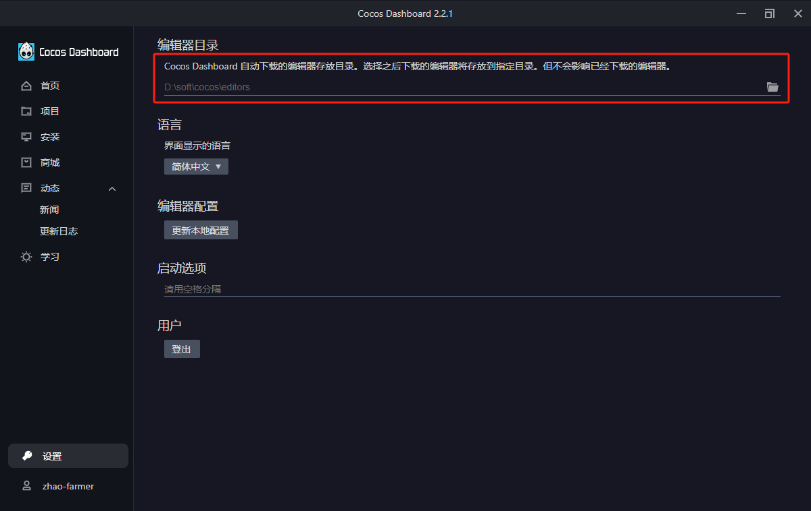

    - 下载cocos版本

    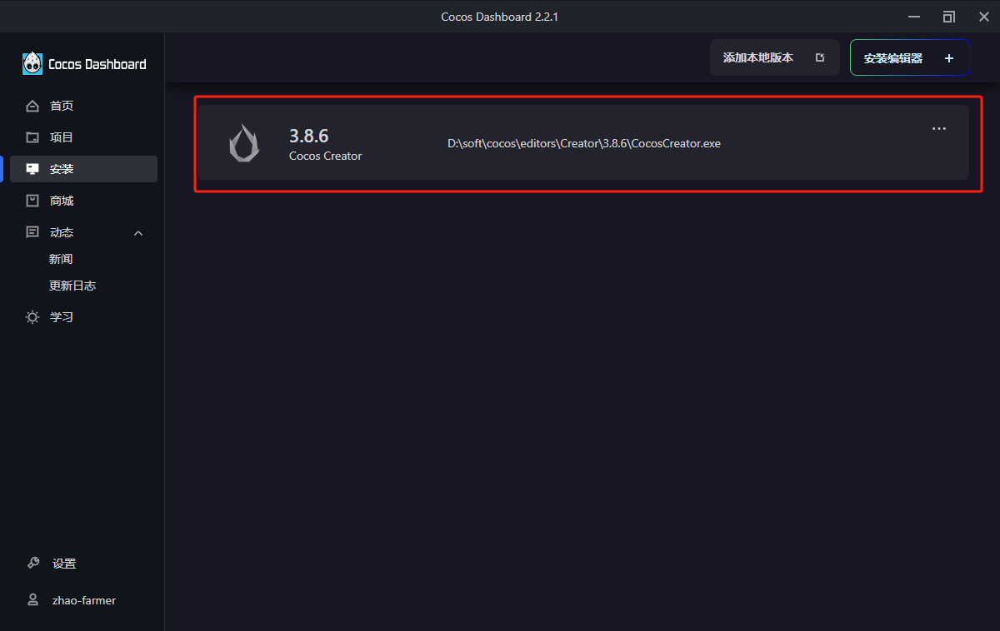

3. 打开项目

    - 新建项目

    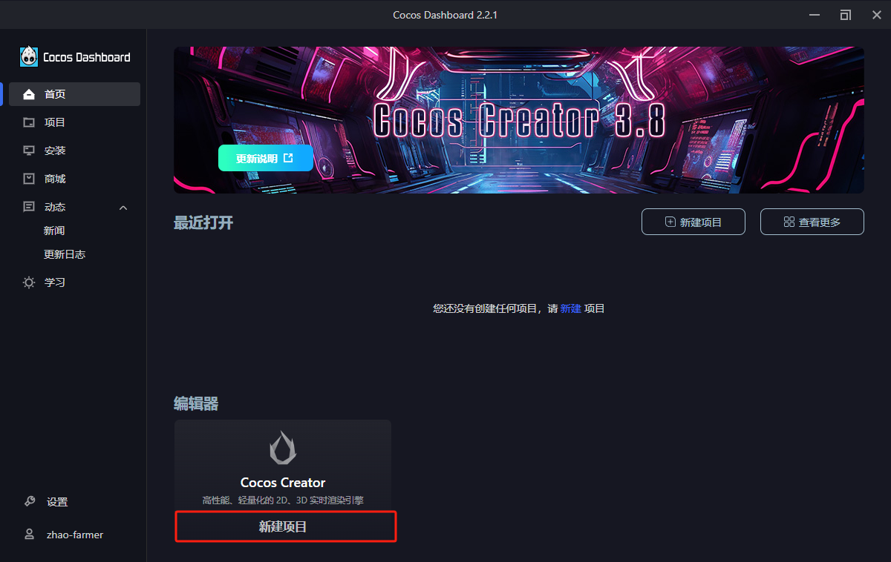

    - 项目配置

    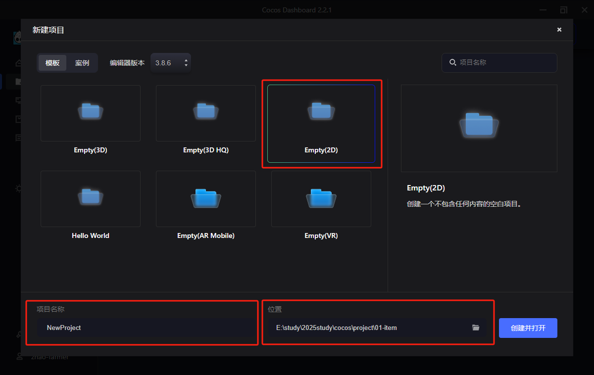

4. 调整Cocos Creator 

    - 修改语言

    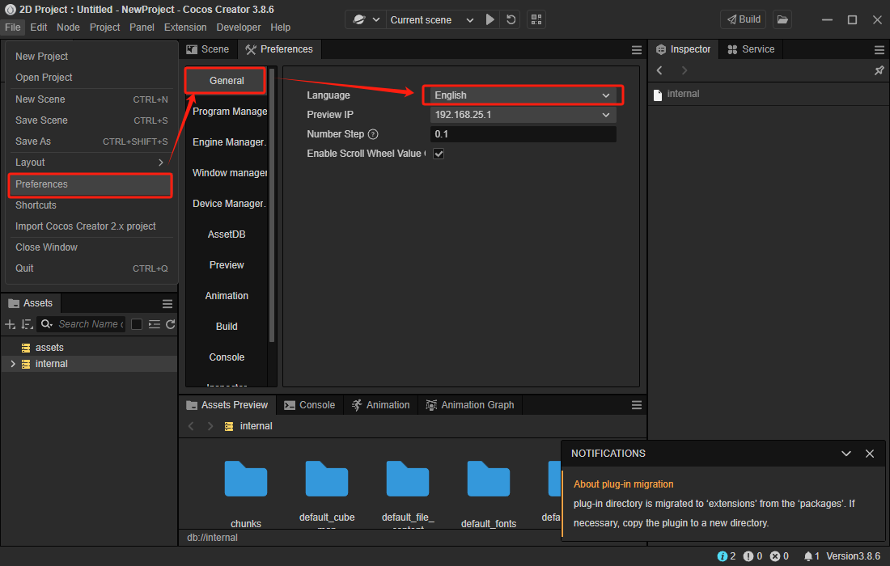

    - 脚本编辑器

    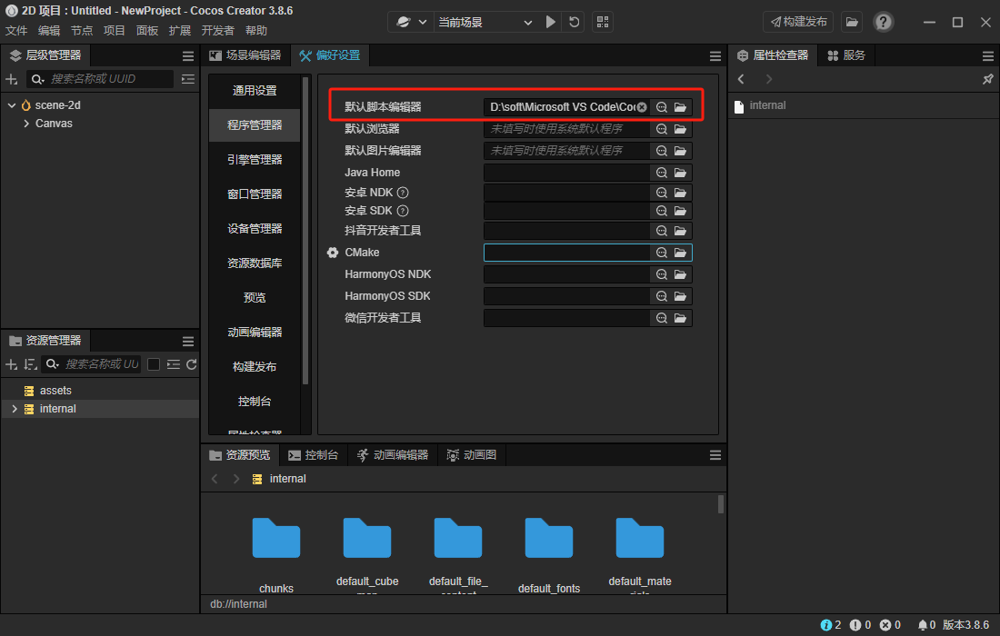

5. 调整vscode

    - 排除文件

    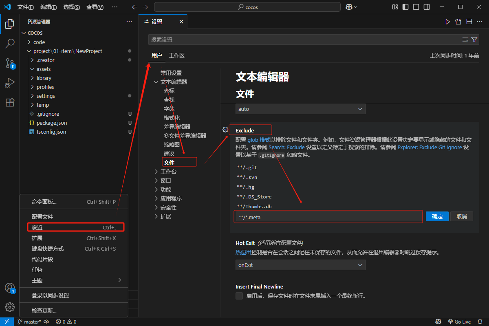

6. 项目结构

    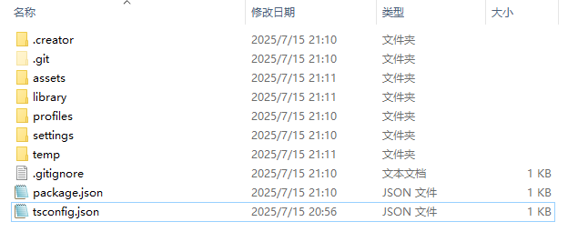

    - assets：资源目录
    - build：构建目录（在构建某平台后会生成该目录）
    - library：导入的资源目录
    - local：日志文件目录
    - profiles：编辑器配置
    - settings：项目设置
    - temp：临时文件目录
    - package.json：项目配置

## 2.2 cocos creator 面向组件

1. 节点（Node）作为功能载体
    1. 节点是基础容器‌
        
        节点是场景中的基本实体，本质上是一个“空壳”，它承载位置、旋转、缩放等基础属性，并形成树状层级关系（父子节点相互影响）。
    2. 节点通过组件赋予功能‌
        
        节点本身不具备具体逻辑能力，需通过挂载‌组件（Component）‌ 实现功能（如渲染、物理、交互等）‌。例如：

        添加 `Sprite` 组件 → 节点可显示图片
        <br>添加 `Button` 组件 → 节点可响应点击
2. 组件（Component）作为功能单元
    1. 组件化封装逻辑‌
        
        每个组件是独立的功能模块（如移动控制、动画播放、数据存储），开发者可通过脚本编写自定义组件，通过 `node.addComponent(MyComponent)` 动态挂载到节点‌。
    2. 组件间解耦协作‌
        
        节点可挂载多个组件，各组件通过节点通信（例如：`this.node.getComponent(PhysicsBody)` 获取同节点的物理组件），实现功能组合而非继承‌

## 2.3 页面快速介绍

1. 快速浏览页面

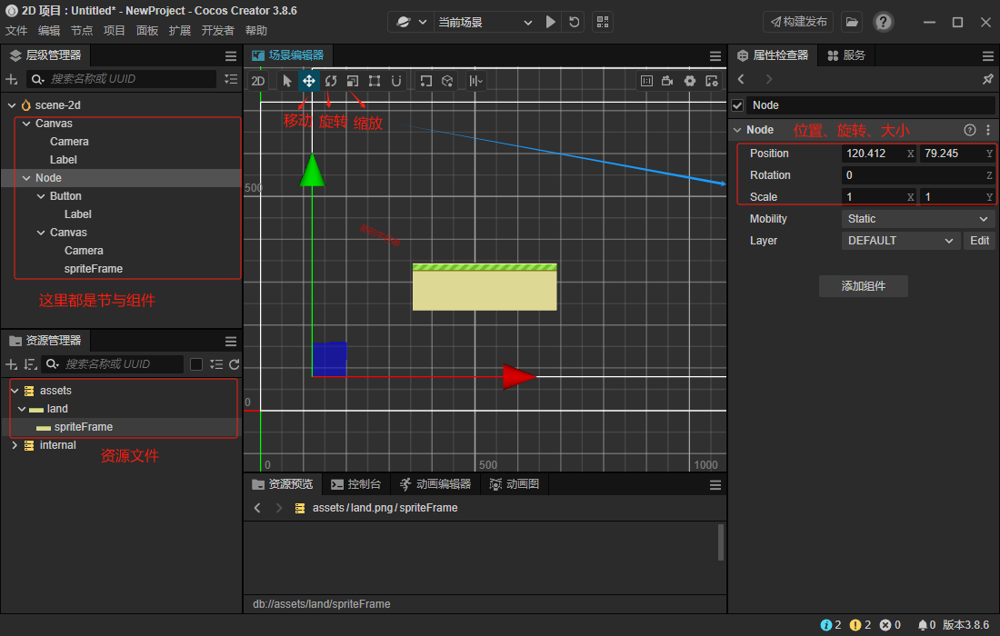

2. 快捷键

    1. 3D 视图

        在 3D 视图下，可以通过以下操作来移动和定位 场景编辑器 的视图：

        - 鼠标左键 + Alt：以视图中心点为中心旋转。
        - 鼠标中键：平移视图。
        - 空格键 + 鼠标/触摸板拖拽：平移视图。
        - 鼠标滚轮：以视图中心点为中心缩放视图。
        - 鼠标右键 + WASD：摄像机漫游。
        - F 快捷键：摄像机聚焦到当前选中节点。


    2. 2D 视图

        在 2D 视图下，可以通过以下操作来移动和定位 场景编辑器 的视图：

        - 鼠标中键：平移视图。
        - 鼠标滚轮：以当前鼠标悬停位置为中心缩放视图。
        - 鼠标右键：平移视图。
        - F 快捷键：摄像机聚焦到当前选中节点。

## 2.4 锚点与坐标系

1. 界面中的坐标轴与锚点

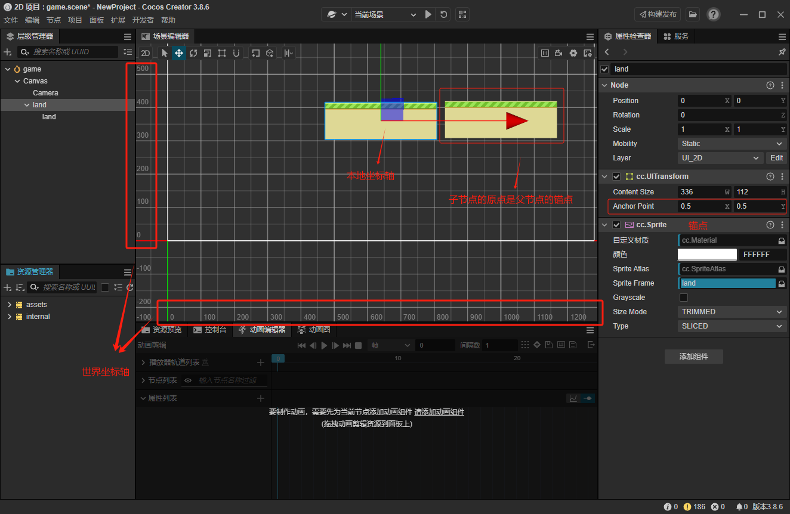


2. 坐标轴

    - 世界坐标‌：全局固定参考系，适用于跨节点交互和底层系统（如物理、输入事件）27。
    - 本地坐标‌：层级化设计核心，简化父子节点相对位置控制 

3. 锚点
    1. 定位基准‌
    
        锚点定义了节点约束框内的参考点（默认为节点中心 (0.5, 0.5)），节点的 position 属性实际是锚点相对于父节点的位置‌。

        例如：锚点设为 (0, 0) 时，节点的左下角将作为定位基准‌。

    2. 影响变换操作‌

        旋转和缩放会以锚点为中心进行。若锚点不在节点中心，旋转时节点会绕锚点偏移‌。

    3. UI 适配关键‌
        
        在 UI 布局中，锚点与 Widget 组件配合，可动态调整节点相对于父容器边缘的位置（如按钮始终贴附屏幕右下角）‌

## 2.5 精灵的使用

1. 介绍

精灵是挂载在节点上的 cc.Sprite 组件，用于显示单张图片或精灵表中的子图帧（SpriteFrame）

2. 创建精灵

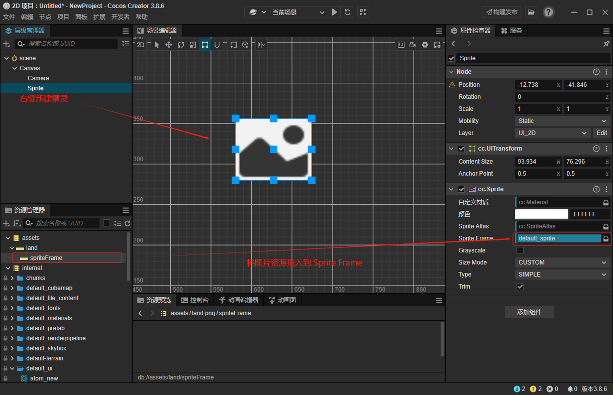

3. 精灵属性

| 属性  | 功能说明      |
|-------|--------------|
| `CustomMaterial`	|自定义材质，使用方法参考 自定义材质|
| `Color`	|图片颜色|
| `Sprite Atlas` |	Sprite 显示图片资源所属的图集（Atlas）。|
| `Sprite Frame` |	渲染 Sprite 使用的 SpriteFrame 图片资源。|
| `Grayscale` |	灰度模式，开启后 Sprite 会使用灰度模式渲染。|
| `Size Mode` |	指定 Sprite 的尺寸 <br> **Trimmed** 表示会使用原始图片资源裁剪透明像素后的尺寸 <br> **Raw** 表示会使用原始图片未经裁剪的尺寸 <br> **Custom** 表示会使用自定义尺寸。当用户手动修改过 Size 属性后，Size Mode 会被自动设置为 Custom，除非再次指定为前两种尺寸。|
| `Type`	| 渲染模式，包括普通（Simple）、九宫格（Sliced）、平铺（Tiled）和填充（Filled）四种模式|
| `Trim`	| 是否渲染原始图像周围的透明像素区域|

4. 渲染模式


    1. 普通模式（Simple）：根据原始图片资源渲染 Sprite，一般在这个模式下我们不会手动修改节点的尺寸，来保证场景中显示的图像和美术人员生产的图片比例一致。


    2. 九宫格模式（Sliced）：图像将被分割成九宫格，并按照一定规则进行缩放以适应可随意设置的尺寸(size)。通常用于 UI 元素，或将可以无限放大而不影响图像质量的图片制作成九宫格图来节省游戏资源空间。

        编辑图像资源的九宫格切分

        1. 首先打开 Sprite 编辑器，在 资源管理器 中选中图像资源
        2. 然后点击 属性检查器 最下面的 编辑 按钮。
        3. 点击 Sprite 编辑器 右上角的绿色对勾来保存

        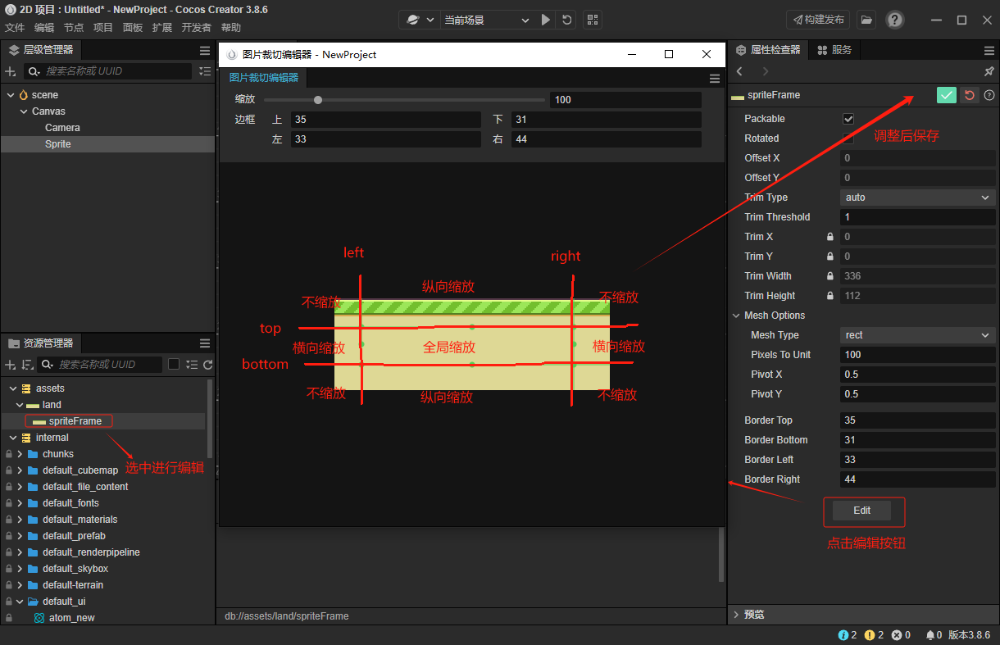

    3. 平铺模式（Tiled）：当 Sprite 的尺寸增大时，图像不会被拉伸，而是会按照原始图片的大小不断重复，就像平铺瓦片一样将原始图片铺满整个 Sprite 规定的大小。

    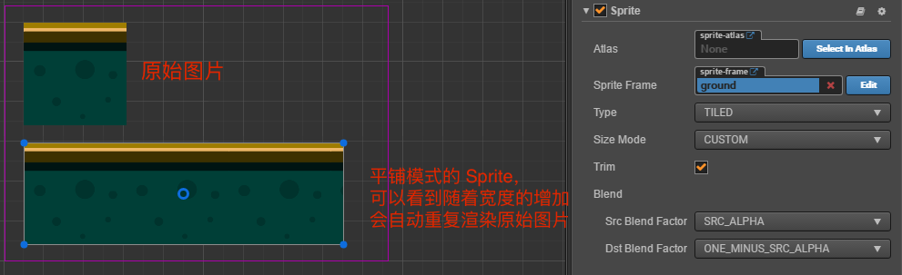

    4. 填充模式（Filled）：根据原点和填充模式的设置，按照一定的方向和比例绘制原始图片的一部分。经常用于进度条的动态展示。

        Type 属性选择填充模式后，会出现一组新的属性可供配置：

        | 属性          | 功能说明                                                                  |
        |-------------|-----------------------------------------------------------------------|
        | Fill Type   | 填充类型选择，有 HORIZONTAL（横向填充）、VERTICAL（纵向填充）和 RADIAL（扇形填充）三种。             |
        | Fill Start  | 填充起始位置的标准化数值（从 0 ~ 1，表示填充总量的百分比），选择横向填充时，Fill Start 设为 0，就会从图像最左边开始填充 |
        | Fill Range  | 填充范围的标准化数值（同样从 0 ~ 1），设为 1，就会填充最多整个原始图像的范围。                           |
        | Fill Center | 填充中心点，该属性只有选择了 RADIAL 填充类型才能修改。决定了扇形填充时会环绕 Sprite 上的哪个点。              |

        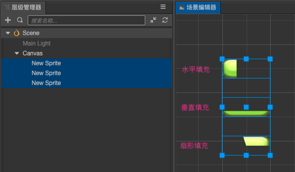

## 2.6 精灵图表

1. 介绍

    精灵表是将多张小图合并为一张大图（并附带 .plist 或 .json 坐标描述文件）的资源包，作用包括：
    
    **减少 DrawCall‌**：合并渲染批次，提升性能;
    ‌<br>**简化动画制作‌**：序列帧动画可直接调用精灵表中的帧

2. 创建精灵表

    - [下载Free texture packer](https://github.com/odrick/free-tex-packer) 或者 [进入网站](https://free-tex-packer.com/app/)

    - 操作步骤

    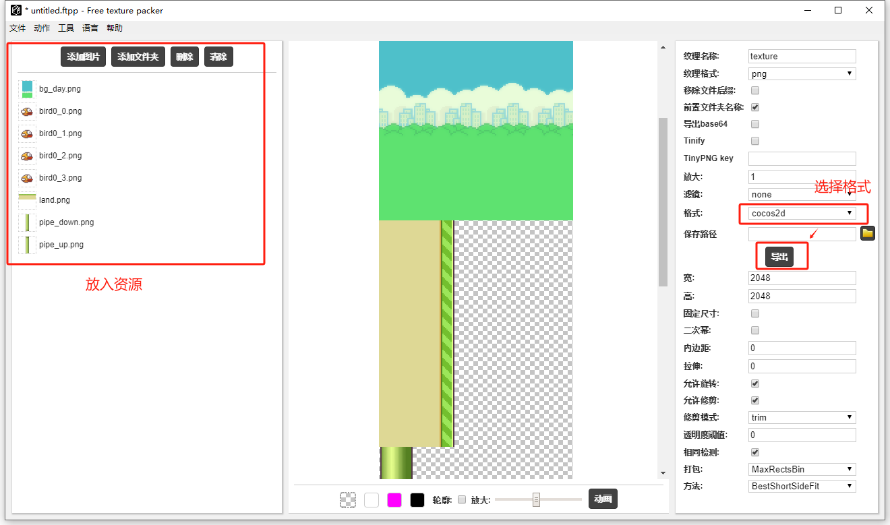

3. 导入cocos creater 使用

    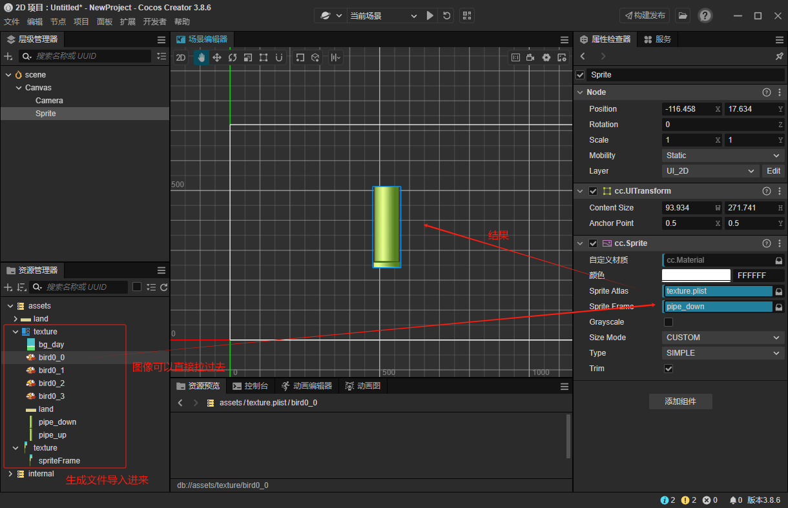

## 2.7 向量以及运算

1. 向量与标量
    - 标量：只有大小的量。(1 85 888 999)
    - 向量：既有大小，也有方向。(坐标轴中：1,2 2,1)

        - 向量的模：向量的大小
        - 单位向量：大小为1的向量
        - 单位化，归一化：把向量转为单位向量的过程

2. 向量的加法

````math`
A(x1,y1) + B(x2,y2) = x1+x2,y1+y2 = 3,3
```

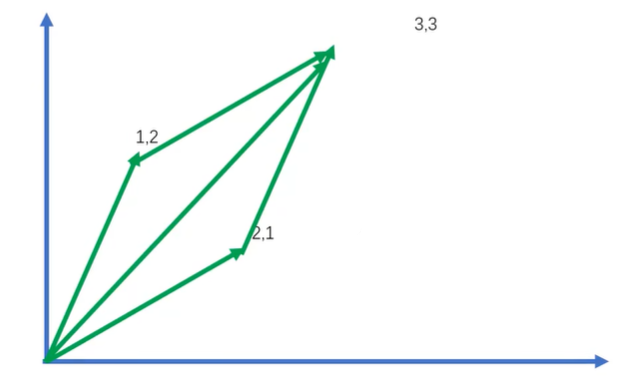

可以确认两条边中间的方向


3. 向量的减法

````math`
A(x1,y1) - B(x2,y2) = x1-x2,y1-y2 = -1,1
```

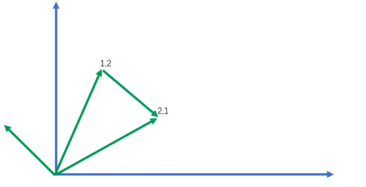

可以得到两点距离的大小与方向


4. 向量的乘法

````math`
A(x1,y1) * 2 = x1*2,y1*2 = 2,4
```

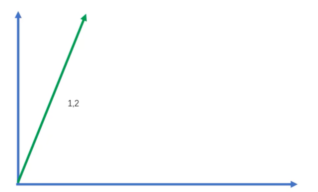


是原来坐标的延申，方向没有改变

5. 点乘

得到两个向量之间的夹角

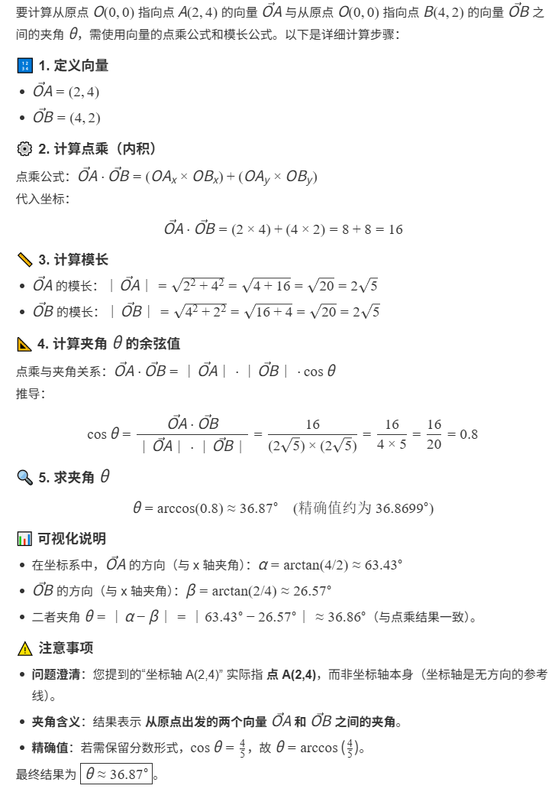


## 2.8 脚本解析

1. 新建脚本

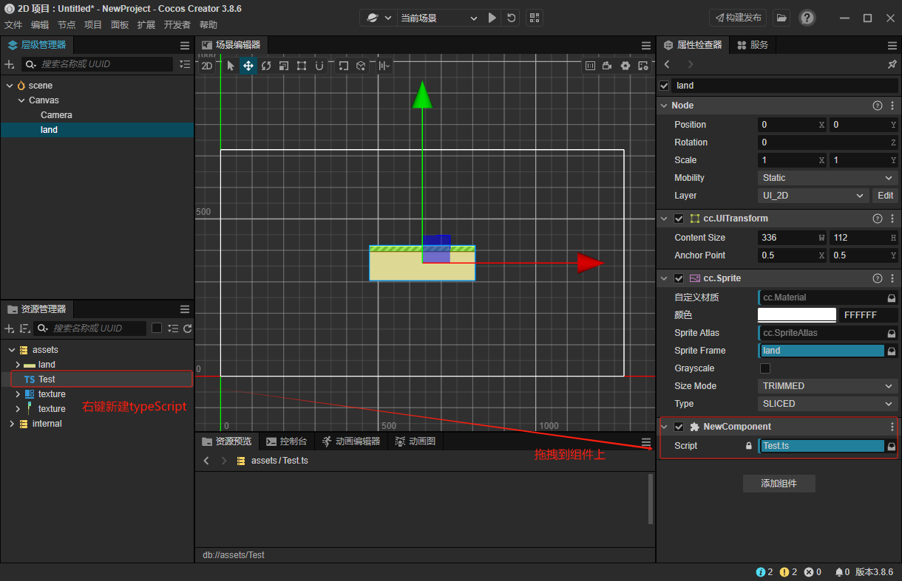

### 2.8.1 脚本运行环境

```js
import {
    Component,  // 导入类 Component
    _decorator, // 导入命名空间 _decorator
    Vec3 // 导入类 Vec3
} from 'cc';
import * as modules from 'cc'; // 将整个 Cocos Creator 模块导入为命名空间 Cocos Creator

@_decorator.ccclass("MyComponent")
export class MyComponent extends Component {
    public v = new Vec3();
}
```

### 2.8.2 装饰器

1. 组件装饰器

    此类装饰器是只能用来修饰 Component 的子类。

    - executeInEditMode

        默认情况下，所有组件都会运行时执行，这个属性运行组件在编辑器模式下运行，默认值`false`

        ```ts{4}
        const { ccclass, executeInEditMode } = _decorator;

        @ccclass('Example')
        @executeInEditMode(true)
        export class Example extends Component {
            update (dt: number) {
                // 会在编辑器下每帧执行
            }
        }
        ```
    - requireComponent

        指定当前组件的依赖组件，默认值为`null`

        ```ts{4}
        const { ccclass, requireComponent } = _decorator;

        @ccclass('Example')
        @requireComponent(Sprite)
        export class Example extends Component {
        }
        ```

    - executionOrder

        指定脚本生命周期回调的执行优先级。小于 0 的脚本将优先执行，大于 0 的脚本将最后执行。排序方式如下：

        - 对于同一节点上的不同组件，数值小的先执行，数值相同的按组件添加先后顺序执行
        - 对于不同节点上的同一组件，按节点树排列决定执行的先后顺序

        该优先级设定只对 onLoad、onEnable、start、update 和 lateUpdate 有效，对 onDisable 和 onDestroy 无效。

        ```ts{4}
        const { ccclass, executionOrder } = _decorator;

        @ccclass('Example')
        @executionOrder(3)
        export class Example extends Component {
        }
        ```

    - disallowMultiple

        同一节点上只允许添加一个同类型（含子类）的组件，防止逻辑发生冲突，默认值为 false。

        ```ts{4}
        const { ccclass, disallowMultiple } = _decorator;

        @ccclass('Example')
        @disallowMultiple(true)
        export class Example extends Component {
        }
        ```

    - menu

        @menu(path) 用来将当前组件添加到组件菜单中，方便用户查找。

        需要注意该菜单是添加在 属性检查器 面板中按下添加组件按钮后的下拉框内。

        ```ts
        const { ccclass, menu } = _decorator;

        @ccclass('Example')
        @menu('foo/bar')
        export class Example extends Component {
        }
        ```

    - help

        指定当前组件的帮助文档的 URL。设置完成后，在 属性检查器 中就会出现一个帮助图标，点击即可打开指定的网页。

        ```ts
        const { ccclass, help } = _decorator;

        @ccclass('Example')
        @help('https://docs.cocos.com/creator/3.5/manual/zh/scripting/decorator.html')
        export class Example extends Component {
        }
        ```
2. 属性装饰器

    属性装饰器 property 可以被应用在 cc 类的属性或访问器上。属性装饰器用于控制 Cocos Creator 编辑器中对该属性的序列化、属性检查器 中对该属性的展示等。

    属性装饰器的各种特性是通过 @property() 的参数来指定的。

    1. type 参数
        
        选项 type 指定了属性的 cc 类型。可以通过以下几种形式的参数指定类型：

        - 基础属性类型

            CCInteger、CCFloat、CCBoolean、CCString 是基础属性类型标识，一般仅用于数组属性的内部类型声明。非数组类型不需要显式声明这些类型。

            - CCInteger 声明类型为 整数
            - CCFloat 声明类型为 浮点数
            - CCString 声明类型为 字符串
            - CCBoolean 声明类型为 布尔值
        - 其他 cc 类型

            所有的 cc 类型 都需要显式指定，否则编辑器无法正确识别类型，序列化也无法写入正确类型。

        - 数组类型

            当使用基础属性类型或者 cc 类作为数组元素时，可以被通过数组类型声明被编辑器所识别。例如 `[CCInteger]`、`[Node]` 将分别以整数数组和节点数组的形式在 属性检查器 中展示。

        - 若属性未指定类型
            
            Cocos Creator 将从属性的默认值或初始化式的求值结果推导其类型：

            - 若值的类型是 JavaScript 原始类型 number、string、boolean，则其类型分别对应 Creator 的CCFloat、CCString 和 CCBoolean。
            - 其他情况下属性的类型则是 未定义 的，编辑器上会提示 Type(Unknown) 字样。
            
        >注意：当声明 JavaScript 内置构造函数 Number、String、Boolean 用作类型时将给出警告，并且将分别视为 cc 类型中的 CCFloat、CCString、CCBoolean。已经初始化的数组属性修改类型后，需要手动清除掉原来的数组数据，重新赋值，否则会因为数据类型不一致，导致数据错乱。
        >注意：需要在编辑器 属性检查器 中展示的属性，属性名开头不应该带 _，否则会识别为 private 属性，private 属性不会在编辑器组件属性面板上显示。


        下列代码演示了不同 cc 类型的属性声明：

        ```ts
        import { _decorator, CCInteger, Node, Enum } from 'cc';
        const { ccclass, property, integer, float, type } = _decorator;

        enum A {
            c,
            d
        }
        Enum(A);

        @ccclass
        class MyClass {
            @property // JavaScript 原始类型，根据默认值自动识别为 Creator 的浮点数类型。
            index = 0;

            @property(Node) // 声明属性 cc 类型为 Node。当属性参数只有 type 时可这么写，等价于 @property({type: Node})
            targetNode: Node | null = null; // 等价于 targetNode: Node = null!;

            // 声明属性 children 的 cc 类型为 Node 数组
            @property({
                type: [Node]
            })
            children: Node[] = [];

            @property({
                type: String,
            }) // 警告：不应该使用构造函数 String。等价于 CCString。也可以选择不声明类型
            text = '';

            @property
            children2 = []; // 未声明 cc 类型，从初始化式的求值结果推断元素为未定义的数组

            @property
            _valueB = 'abc'; // 此处 '_' 开头的属性，只序列化，不会在编辑器属性面板显示

            @property({ type: A })
            accx : A = A.c;
        }
        ```

        为了方便，额外提供几种装饰器以快速声明 cc 类型。如果你只需要为属性定义 type 参数，那么可以直接使用下列装饰器替代 @property：

        | 装饰器      | 对应的 property 写法      |
        |----------|----------------------|
        | @type(t) | @property(t)         |
        | @integer | @property(CCInteger) |
        | @float   | @property(CCFloat)   |

        ```ts
        import { _decorator, CCInteger, Node } from 'cc';
        const { ccclass, property, integer, float, type } = _decorator;
        @ccclass
        class MyClass {
            @integer // 声明属性的 cc 类型为整数
            index = 0;

            @type([Node]) // 声明属性 children 的 cc 类型为 Node 数组
            children: Node[] = [];

            @type(String) // 警告：不应该使用构造函数 String。等价于 CCString。也可以选择不声明类型
            text = '';
            // JavaScript 原始类型 `number`、`string`、`boolean` 通常可以不用声明
            // 可以直接写
            @property
            text = '';
        }
        ```

    - visible

        一般情况下，属性是否显示在 属性检查器 中取决于属性名是否以 _ 开头。如果是以 _ 开头，则不显示。

        如果要强制显示在 属性检查器 中，可以设置 visible 参数为 true：

        ```ts
        @property({ visible: true })
        private _num = 0;
        ```

        如果要强制隐藏，可以设置 visible 参数为 false：

        ```ts
        @property({ visible: false })
        num = 0;
        ```

    - serializable

        属性默认情况下都会被序列化，序列化后就会将编辑器中设置好的属性值保存到场景等资源文件中，之后在加载场景时就会自动还原成设置好的属性值。如果不想序列化，可以设置 serializable: false。

        ```
        @property({ serializable: false })
        num = 0;
        ```
    - override

        所有属性都会被子类继承，如果子类要覆盖父类同名属性，需要显式设置 override 参数，否则会有重名警告：

        ```
        @property({ tooltip: "my id", override: true })
        id = "";
        ```
    - group
        当脚本中定义的属性过多且杂时，可通过 group 对属性进行分组、排序，方便管理。同时还支持对组内属性进行分类。

        group 写法包括以下两种：

        - @property({ group: { name } })

        - @property({ group: { id, name, displayOrder, style } })

        | 参数                            | 说明                                                 |
        |-------------------------------|----------------------------------------------------|
        | id                            | 分组 ID，string 类型，是属性分组组号的唯一标识，默认为 default。          |
        | name                          | 组内属性分类的名称，string 类型。                               |
        | displayOrder                  | 对分组进行排序，number 类型，数字越小，排序越靠前。默认为 Infinity，表示排在最后面。 |
        | 若存在多个未设置的分组，则以在脚本中声明的先后顺序进行排序 |                                                    |
        | style                         | 分组样式，目前支持 tab 和 section 样式。 默认为 tab。               |

        示例脚本如下：

        ```ts
        import { _decorator, Component, Label, Sprite } from 'cc';
        const { ccclass, property } = _decorator;

        @ccclass('SayHello')
        export class SayHello extends Component {

            // 分组一
            // 组内名为 “bar” 的属性分类，其中包含一个名为 label 的 Label 属性
            @property({ group: { name: 'bar' }, type: Label }) 
            label: Label = null!; 
            // 组内名为 “foo” 的属性分类，其中包含一个名为 sprite 的 Sprite 属性
            @property({ group: { name: 'foo' }, type: Sprite }) 
            sprite: Sprite = null!;

            // 分组二
            // 组内名为 “bar2” 的属性分类，其中包含名为 label2 的 Label 属性和名为 sprite2 的 Sprite 属性，并且指定排序为 1。
            @property({ group: { name: 'bar2', id: '2', displayOrder: 1 }, type: Label }) 
            label2: Label = null!; 
            @property({ group: { name: 'bar2', id: '2' }, type: Sprite }) 
            sprite2: Sprite = null!;

        }
        ```

        将该脚本挂载到节点上，则在 属性检查器 中显示为：

        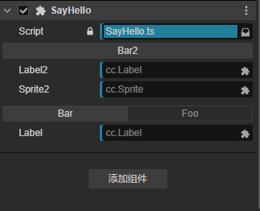

### 2.8.3 声明周期函数

```ts
import { _decorator, Component } from 'cc';
const { ccclass } = _decorator;

@ccclass("Test")
export class Test extends Component {
    
    // 脚本初始化 onload总在start前面
    onLoad(){
        console.log("onLoad");
    }

    // 组件启用时调用 与 onDisable 是一对
    onEnable(){
        console.log("onEnable");
    }

    // 开始加载
    start(){
        console.log("start");
    }

    // 每一帧都会调用它
    update(){
        console.log("update");
    }

    // update后调用
    lastUpdate(){
        console.log("lastUpdate");
    }

    // 组件非启用 关闭时调用
    onDisable(){
        console.log("onDisable");
    }

    // 销毁时嗲用
    onDestroy(){
        console.log("onDestroy");
    }
}
```

## 2.9 节点与UI变换组件

每个节点上都有这两个基础组件 `node` 与 `cc.UITransform`

### 2.9.1 node组件

1. 界面位置

    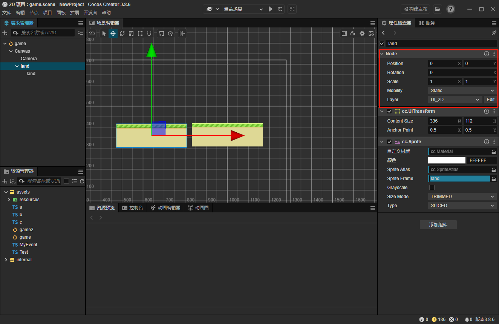

2. 属性介绍

    - Position：位置
    - Rotation: 旋转
    - Scale：缩放
    - Mobility：节点的可移动性(跟摄像机相关，2D可以不用管)。
        - 对于持有光源组件的节点
            - Static 静态光源：会烘焙直接光与间接光，烘焙完运行时不参与计算
            - Stationary 固定光源：只烘焙间接光，只在运行时计算直接光
            - Movable 可移动光源：不参与烘焙，只在运行时计算直接光
        - 对于持有 MeshRenderer 的节点
            - Static & Stationary 静态物体：可使用光照贴图
            - Movable 动态物体：可使用光照探针 通常来说在拥有 MeshRenderer 组件的节点上可以添加灯光组件，但并不建议，可以考虑分开多个节点来实现这样的需求。
    - Layer：设定节点的可见性能力(2D可以不用管)。

### 2.9.2 UITransform组件


1. 界面位置

    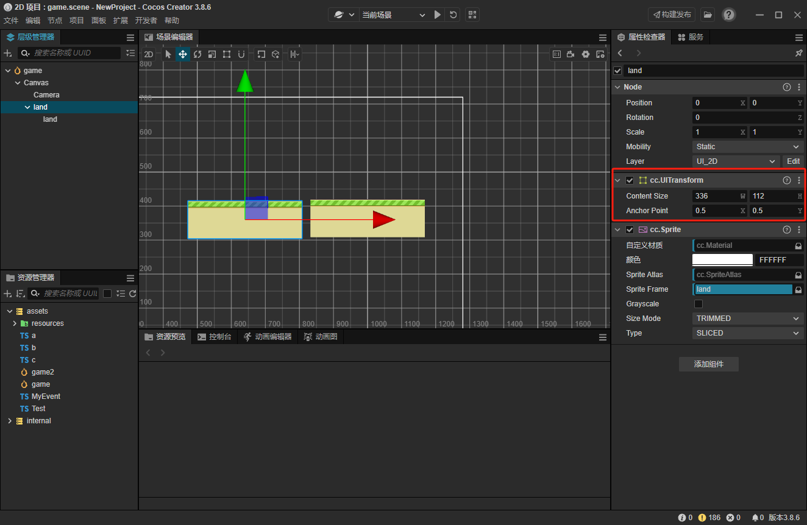

2. 属性介绍


    定义了 UI 上的矩形信息，包括矩形的尺寸和锚点位置。开发者可以通过该组件任意地操作矩形的大小、位置。一般用于渲染、点击事件的计算、界面布局以及屏幕适配等。

    - ContentSize：`UI 矩形`内容尺寸
    - AnchorPoint：`UI 矩形`锚点位置

### 2.9.3 常用属性方法

```ts
import { _decorator, Component, find,Sprite,v3,UITransform } from 'cc';
const { ccclass } = _decorator;

@ccclass("Test2")
export class Test2 extends Component {

    // 初始化调用
    start(){


        /* --------------- 方法 --------------- */

        // 获取第一个子节点
        let ddd =  this.node.children[0]
        // 通过名称获取子节点
        this.node.getChildByName("abc")
        // 获取其他组件的子节点
        find("Canvas/Main Camera")

        // 获取父节点
        this.node.getParent()
        // 移除父节点
        this.node.setParent(null)
        
        // 移除所有子节点
        this.node.removeAllChildren()
        // 移除某个子节点
        this.node.removeChild(ddd)
        // 从父节点移除本身
        this.node.removeFromParent()

        /* --------------- 属性 --------------- */

        // 访问位置
        this.node.x;
        this.node.y;
        this.node.setPosition(3,4);
        this.node.setPosition(v3(3,4))

        // 旋转  需要使用四元素设置角度
        this.node.rotation
        // 欧拉角旋转
        this.node.setRotationFromEuler(90, 90)

        // 缩放
        this.node.setScale(2, 2);

        // node节点开关
        this.node.active = false;
        // 组件开关
        this.enabled = false;

        /* --------------- 获取组件 --------------- */
        
        // 精灵
        let sprite =  this.getComponent(Sprite);
        sprite.enabled = false
        // 获取精灵数组
        let sprites =  this.getComponents(Sprite)

        // 获取子组件
        this.getComponentInChildren(Sprite);


        // 创建节点
        let node = new Node("new");
        // 添加组件
        node.addComponent(Sprite);
        
        /* --------------- UITransform --------------- */

        // 获取 UI 变换组件
        const uiTransform = this.getComponent(UITransform);
        //  获取锚点与大小
        uiTransform.setContentSize(200, 120);
        uiTransform.setAnchorPoint(0, 0.5);

        // 获取锚点与大小
        uiTransform.width = 200;
        uiTransform.height = 120;
        uiTransform.anchorX = 0;
        uiTransform.anchorY = 0.5;

    }
}
```

## 2.10 预设体

预设体的意义，相同的组件不再创建多次，能够独立修改

1. 组件拖拽成预设体(存档)

    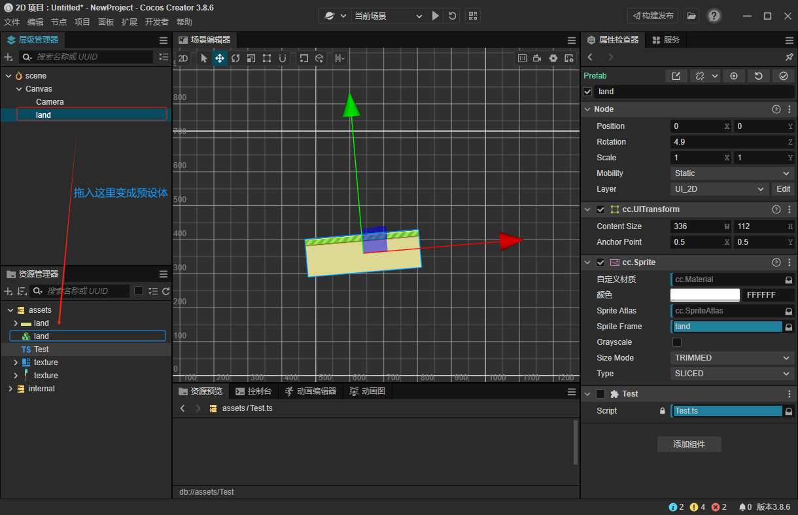

2. 预设体修改(读档)

    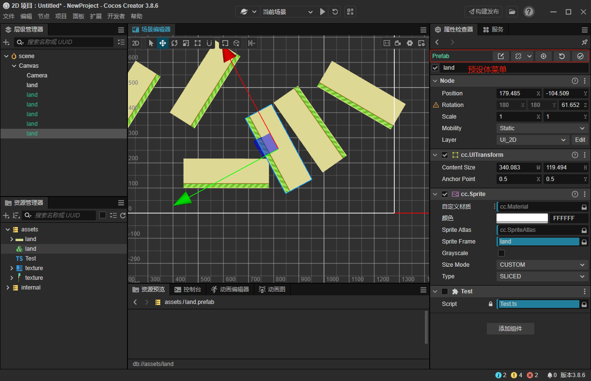

    - 修改预设体：修改后的预设体并不会马上关联，下次继续拖拽会展示修改后的预设体
    - 移除预设体关联：不再是预设体
    - 定位资源：定位到资源目录具体设定的预设体
    - 从资源还原：回到刚生成时的状态
    - 更新到资源：当前状态更新到预设体

3. 脚本创建预设体

    - 脚本

    ```ts
    import { _decorator, Component,instantiate,Prefab } from 'cc';
    const { ccclass,property } = _decorator;

    @ccclass("Test")
    export class Test extends Component {
    
        // 预设属性
        @property({ type: Prefab })
        pre: Prefab;

        start() {
            // 初始化
            const newNode = instantiate(this.pre);
            // 添加到当前节点的子节点
            newNode.setParent(this.node)
        }

        update(){
        
        }
    }
    ```

    - 预设体做拽到脚本里

    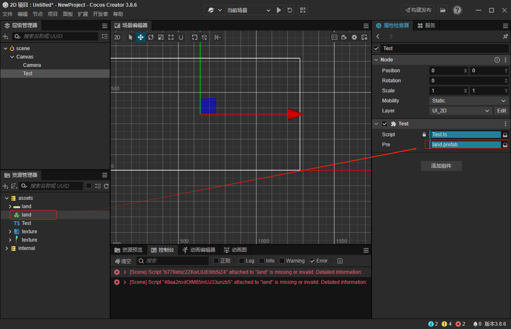


    - 运行后，才能发现组件

    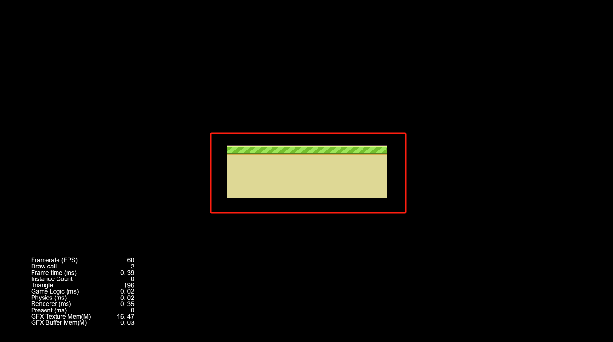

## 2.11 资源的动态加载

1. 设置一个组件下精灵不存在,挂载了脚本

    - 界面
    
    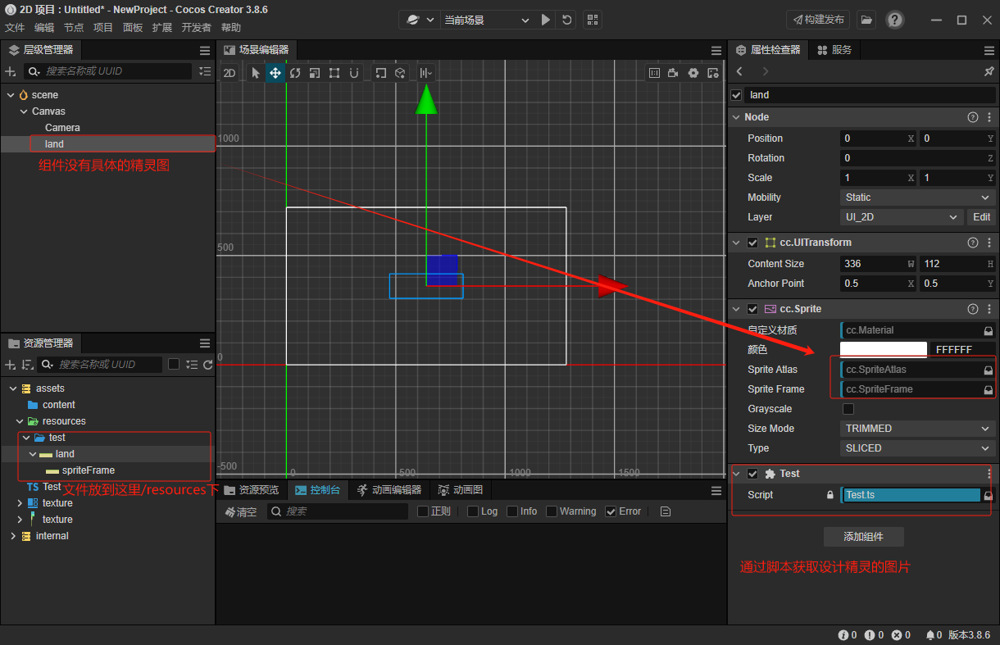

    - 脚本代码

    ```ts
    import { _decorator, Component,resources, Sprite, SpriteFrame } from 'cc';
    const { ccclass } = _decorator;

    @ccclass("Test")
    export class Test extends Component {
    
        // 初始化调用
        start() {
            resources.load("test/land/spriteFrame", SpriteFrame, (err, spriteFrame) => {
                const sprite = this.getComponent(Sprite);
                sprite.spriteFrame = spriteFrame;
            });
        }
        // 每帧调用
        update(){
        
        }
    }
    ```

    - 结果

    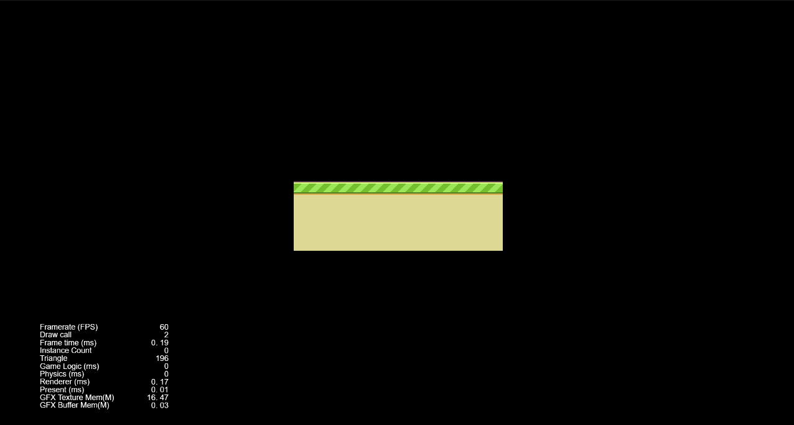

3. 加载图集

    - 界面

    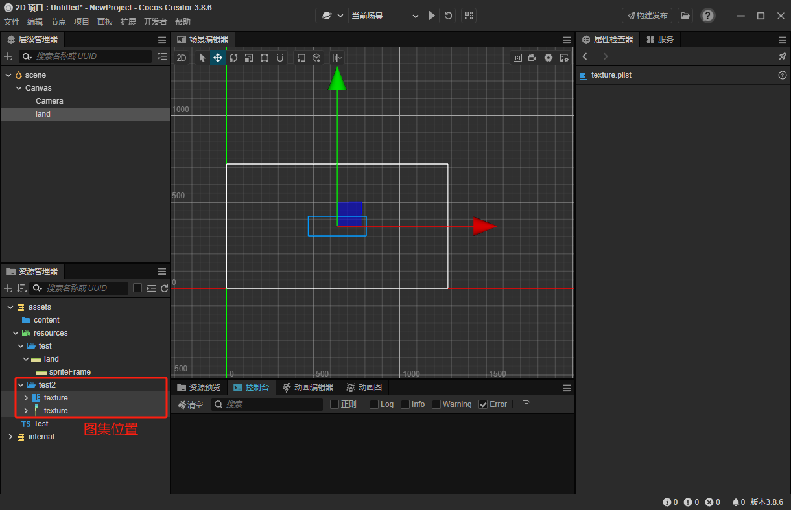

    - 代码

    ```ts
    import { _decorator, Component,resources, Sprite, SpriteAtlas, SpriteFrame } from 'cc';
    const { ccclass } = _decorator;

    @ccclass("Test")
    export class Test extends Component {
    
        // 初始化调用
        start() {
            resources.load("test2/texture", SpriteAtlas, (err, atlas:SpriteAtlas) => {
                const sprite = this.getComponent(Sprite);

                sprite.spriteFrame = atlas.getSpriteFrame("bg_day");
            });
        }
        // 每帧调用
        update(){
        
        }
    }
    ```
    - 结果

    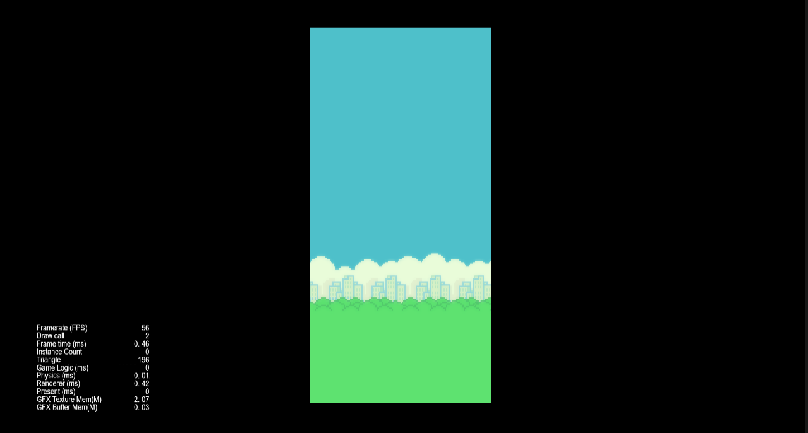

## 2.12 场景管理


1. 保存第一个场景，并新建label组件

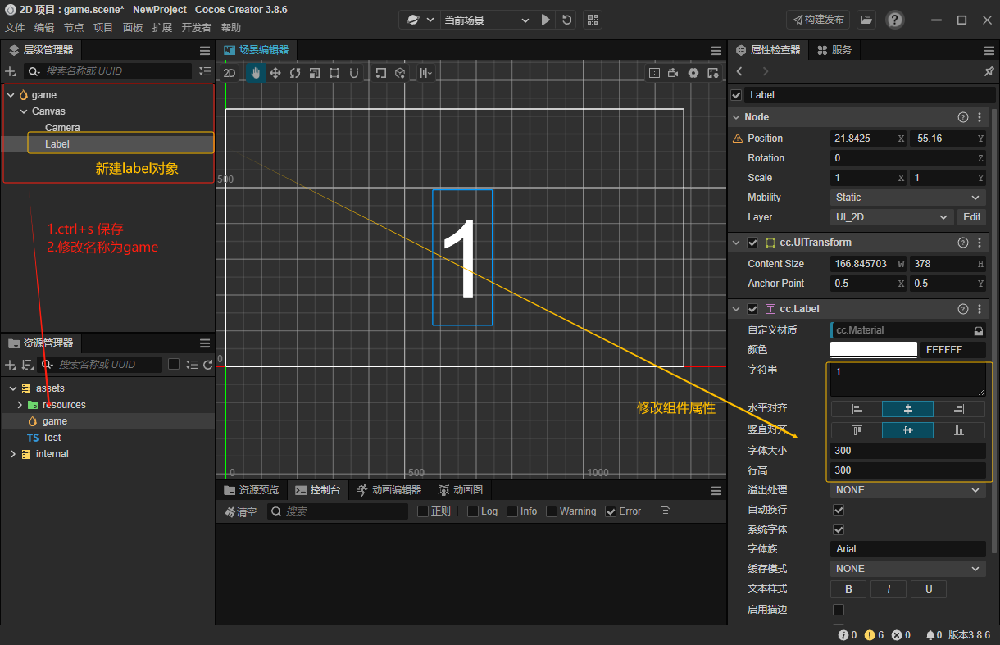


2. 新建场景，添加label,并保存

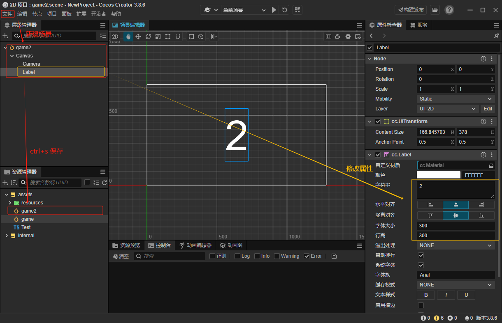

3. 脚本


    - 代码

    ```ts
    import { _decorator, Component,game, director } from 'cc';
    const { ccclass } = _decorator;

    @ccclass("Test")
    export class Test extends Component {
    
        // 初始化调用
        start() {
            // 加载第二个场景
            director.loadScene("game2",function(){
                // 当前已经加载到新的场景里了
            })
            // 预加载
            director.preloadScene("game2",function(){
                // 这个场景已经加载到内除了，但是还没有用
            })

            // 常驻节点 不同的场景里都有它
            director.addPersistRootNode(this.node);
            director.removePersistRootNode(this.node);

        }
        // 每帧调用
        update(){
        
        }
    }
    ```

    - 拖拽到第一个场景中使用

    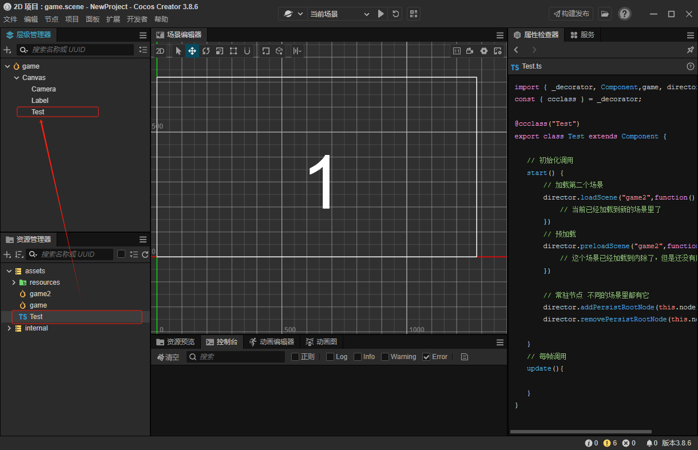

## 2.13 操作交互

准备工作：新建节点与挂载脚本

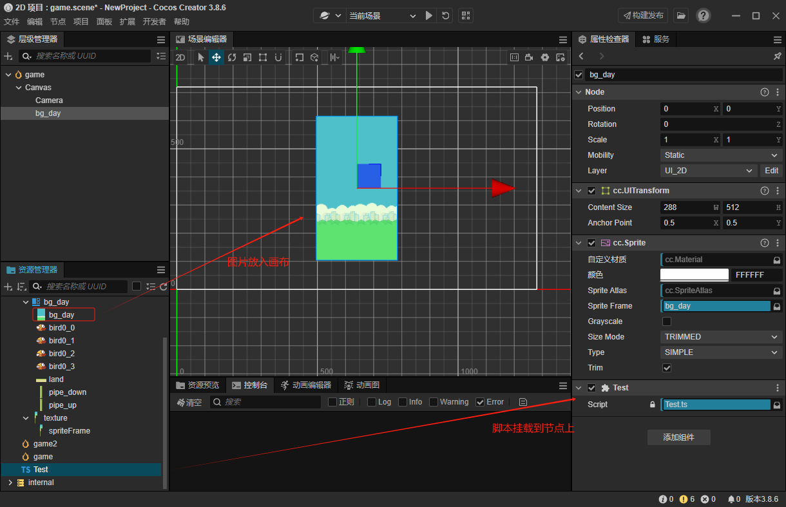

>注意：事件触发只会在节点自身区域内


### 2.13.1 鼠标事件

```ts
import { _decorator, Component, Input, EventMouse } from "cc";
const { ccclass } = _decorator;

@ccclass("Test")
export class Test extends Component {
    // 初始化调用
    start() {

        // 提示信息中的 Input.EventType.MOUSE_LEAVE 
        this.node.on(Input.EventType.MOUSE_DOWN, function (event: EventMouse) {
            console.log("鼠标按下触发:", event.getLocation());
            
            // 判断左键右键
            if(event.getButton() === 0||event.getButton() === EventMouse.BUTTON_RIGHT){
                console.log("左键");
            }
            if(event.getButton() === 1){
                console.log("滚轮");
            }
             if(event.getButton() === 2 || event.getButton() === EventMouse.BUTTON_LEFT ){
                console.log("右键");
            }
        });
        this.node.on(Input.EventType.MOUSE_UP, function (event: EventMouse) {
            console.log("鼠标松开触发:", event.getLocation());
        });
        this.node.on(Input.EventType.MOUSE_MOVE, function (event: EventMouse) {
            console.log("鼠标移动触发:", event.getLocation());
        });
        this.node.on(Input.EventType.MOUSE_LEAVE, function (event: EventMouse) {
            console.log("鼠标离开触发:", event.getLocation());
        });
        this.node.on(Input.EventType.MOUSE_WHEEL, function (event: EventMouse) {
            console.log("鼠标滚轮触发:", event.getLocation());
        });

        // 停止监听
        this.node.off(Input.EventType.MOUSE_UP)
        

    }
    // 每帧调用
    update() {}
}
```

>注意：代码提示中的`Input.EventType.MOUSE_LEAVE`,已经没有作用

### 2.13.2 键盘事件

键盘事件是能使用input监听，不使用本节点，鼠标触摸两种都可以

```ts
import { _decorator, Component, Input, input, EventKeyboard, KeyCode } from "cc";
const { ccclass } = _decorator;

@ccclass("Test")
export class Test extends Component {
    // 初始化调用
    start() {
        input.on(Input.EventType.KEY_DOWN, function (event: EventKeyboard) {
            console.log("键盘按下触发");

            if(event.keyCode == KeyCode.KEY_A){
                console.log("按下A触发");
            }
            if(event.keyCode == KeyCode.KEY_B){
                console.log("按下B触发");
            }
        });
        input.on(Input.EventType.KEY_PRESSING, function (event: EventKeyboard) {
            console.log("键盘持续按下触发");
        });
        input.on(Input.EventType.KEY_UP, function (event: EventKeyboard) {
            console.log("键盘释放触发");
        });

        // 销毁监听
        input.off(Input.EventType.KEY_UP)
    }
    // 每帧调用
    update() {}
}
```

### 2.13.3 触摸事件

触摸主要是为了移动端交互，如果不关注鼠标左键右键滚轮，直接使用触摸代替键盘也可以

```ts
import { _decorator, Component, Input, input, EventTouch } from "cc";
const { ccclass } = _decorator;

@ccclass("Test")
export class Test extends Component {
    // 初始化调用
    start() {
        // 系统触发
        input.on(Input.EventType.TOUCH_START,function(event: EventTouch){
             console.log("触摸点开始触发",event.getLocation());
             // 多点位触发:根据ID编号(从零自增) 判断是否多点位
             console.log( event.getID());
             
        })
        // 节点触发
        this.node.on(Input.EventType.TOUCH_MOVE, function (event: EventTouch) {
            console.log("触摸移动");
        });
        this.node.on(Input.EventType.TOUCH_CANCEL, function (event: EventTouch) {
            console.log("当触摸被意外中断时触发（如来电、弹窗、手势冲突等导致触摸提前终止）");
        });
         this.node.on(Input.EventType.TOUCH_END, function (event: EventTouch) {
             console.log("当用户正常结束触摸时触发（例如手指从屏幕抬起）");
        });

        // 关闭监听
        this.node.off(Input.EventType.TOUCH_CANCEL)
    }
    // 每帧调用
    update() {}
}
```

### 2.13.4 自定义事件

1. 自身组件内触发

```ts
import { _decorator, Component, Input, input, EventTouch} from "cc";
const { ccclass } = _decorator;

@ccclass("Test")
export class Test extends Component {
    // 初始化调用
    start() {
        let self = this;
        input.on(Input.EventType.TOUCH_START,function(event: EventTouch){
            // 直接触发自定义事件
           self.node.emit("myevent1")
            
        })
        this.node.on("myevent1",function(event){
            console.log("自定义事件");
        })
    }
    // 每帧调用
    update() {}
}
```

2. 派发事件-逐层传递


    - 组件与脚本结构

    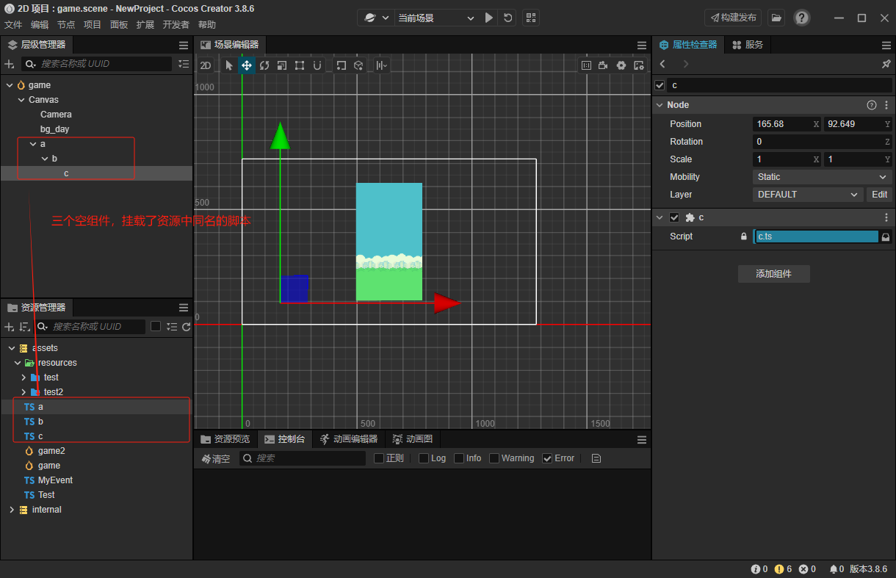

    - 公用脚本 MyEvent.ts

    ```ts
    // Event 由 cc 模块导入
    import { Event } from 'cc';

    // 新建事件类型
    class MyEvent extends Event {
        constructor(name: string, bubbles?: boolean, detail?: any) {
            super(name, bubbles);
            this.detail = detail;
        }
        public detail: any = null;  // 自定义的属性
    }

    export default MyEvent
    ```

    - 触发脚本 c.ts

    ```ts
    import { _decorator, Component,input,Input,EventKeyboard } from 'cc';
    const { ccclass } = _decorator;
    import MyEvent from './MyEvent';

    @ccclass('c')
    export class c extends Component {
        start() {
            console.log("C组件加载");
            
            // 开始 使用 dispatchEvent 派发事件
            this.node.dispatchEvent( new MyEvent('foobar', true, 'detail info') );
        }
    }
    ```

    - 阻止冒泡脚本 b.ts

    ```ts
    import { _decorator, Component } from 'cc';
    const { ccclass } = _decorator;
    import MyEvent from './MyEvent';

    @ccclass('b')
    export class b extends Component {
        start() {
            // 监控事件
            this.node.on('foobar', (event: MyEvent) => {
                console.log("b节点");
                // 阻止冒泡：事件不再传递
                event.propagationStopped = true;
            });
        }

    }
    ```

    - 验证是否阻止成功 a.ts

    ```ts
    import { _decorator, Component } from 'cc';
    const { ccclass } = _decorator;
    import MyEvent from './MyEvent';

    @ccclass('a')
    export class a extends Component {
        start() {
            // 监控事件
            this.node.on('foobar', (event: MyEvent) => {
                console.log("a节点");
            });
        }
    }
    ```

## 2.14 音频系统

AudioSource 属性

| 属性          | 说明                               |
|-------------|----------------------------------|
| Clip        | 添加的用于播放的 音频资源，默认为空，点击后面的箭头按钮即可选择 |
| Loop        | 是否循环播放                           |
| PlayOnAwake | 是否在游戏运行（组件激活）时自动播放音频             |
| Volume      | 音量大小，范围在 0~1 之间                  |


1. 界面操作

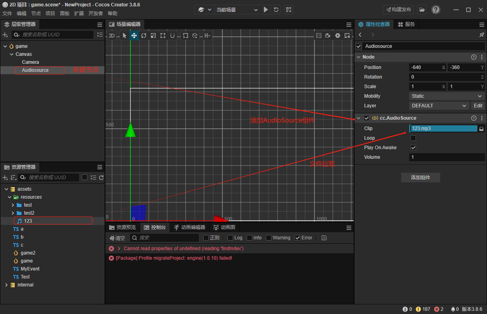

2. 异步加载脚本

    - 界面修改

    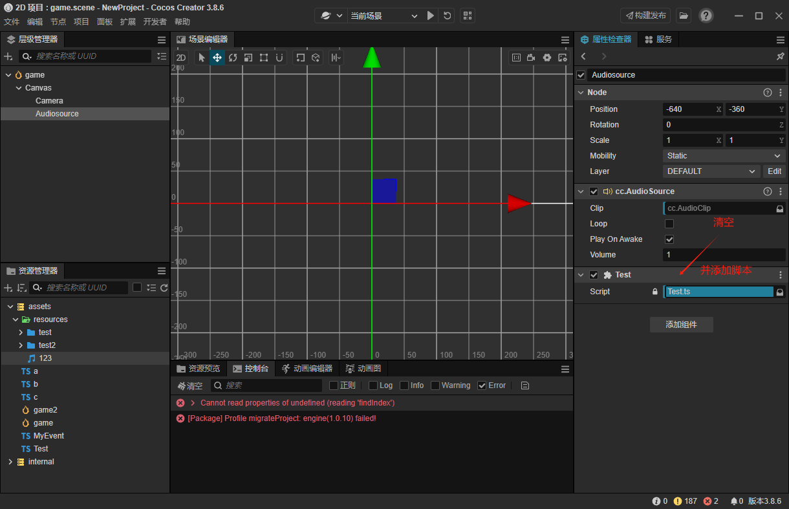

    - 脚本

    ```ts
    import { _decorator, Component,AudioClip, error, resources,AudioSource } from 'cc';
    const { ccclass,property } = _decorator;

    @ccclass("Test")
    export class Test extends Component {

        onLoad () {

            console.log(123);
            
        // 异步加载音频
            resources.load("123", AudioClip, (err: Error, clip: AudioClip) => {
                if (err) {
                    error(err.message);
                    return;
                }
                
                // 创建音频源组件
                const audioSource = this.node.addComponent(AudioSource);
                // 加载音频文件
                audioSource.clip = clip;

                // 播放
                audioSource.play();

                // 暂停
                audioSource.pause();

                // 停止
                audioSource.stop();

                // 循环播放
                audioSource.loop = true;

                // 设置音量 (0.0 - 1.0)
                audioSource.volume = 0.5;
            });
        }
    }

    ```

3. 一次性脚本(播放完就消失，如枪声)

```ts
import { AudioSource, AudioClip } from 'cc';

// 不保留AudioSource组件的方式
AudioSource.playOneShot(clip, volume = 1.0);
```

## 2.15 计时器

```ts
import { _decorator, Component } from 'cc';
const { ccclass } = _decorator;

@ccclass("Test")
export class Test extends Component {

    start(){
        // 四个参数 回调函数 间隔事件(秒) 重复次数 多长事件后开启(秒)
        this.schedule(()=>{
            console.log("计时器回调函数");
        },0.5,50,0.3)
    }
}
```