# 三、cocos creator 进阶


## 3.1 碰撞检测


1. 调整物理引擎

    Cocos Creator 有轻量的 `Builtin` 物理系统与更强的 `Box2D` 物理系统。

    Cocos Creator 3.8.6 现在默认是 Box2D 物理系统，要调回 `Builtin`

    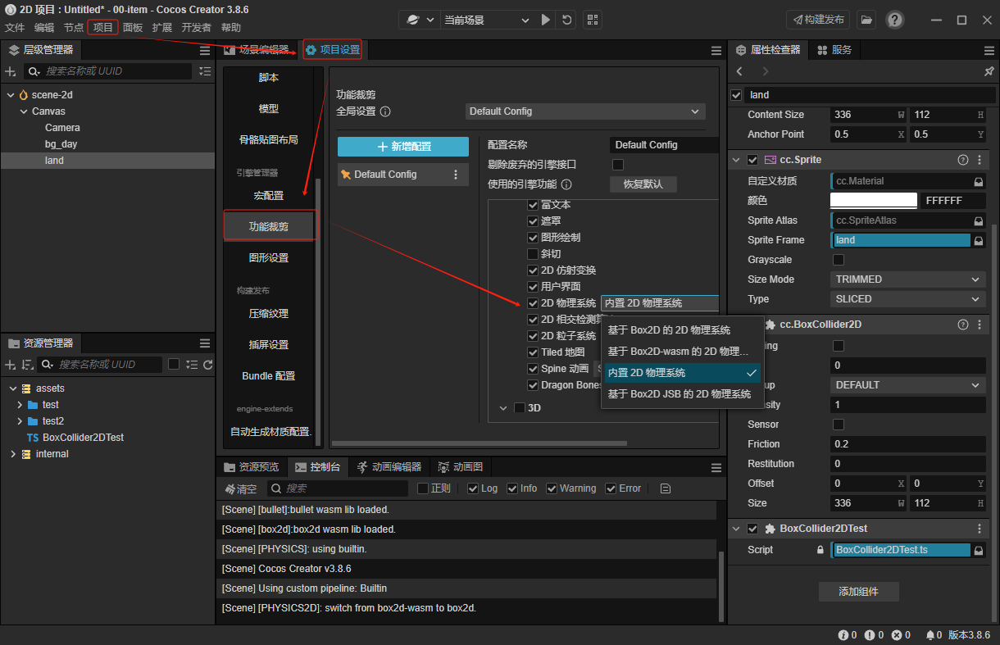

2. 操作界面

    - 添加组件

    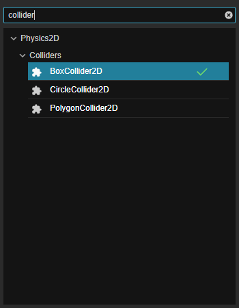

    - 第一个碰撞体

    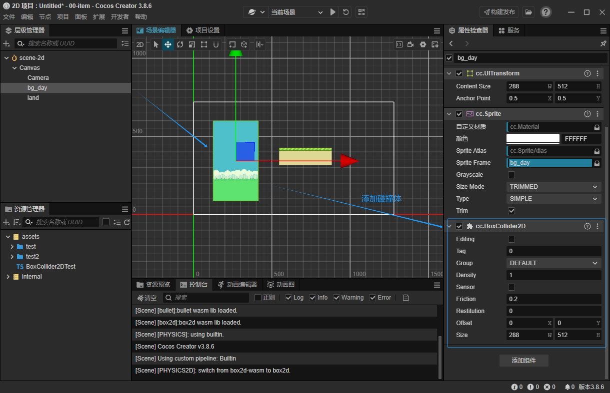

    - 第二个碰撞与脚本

    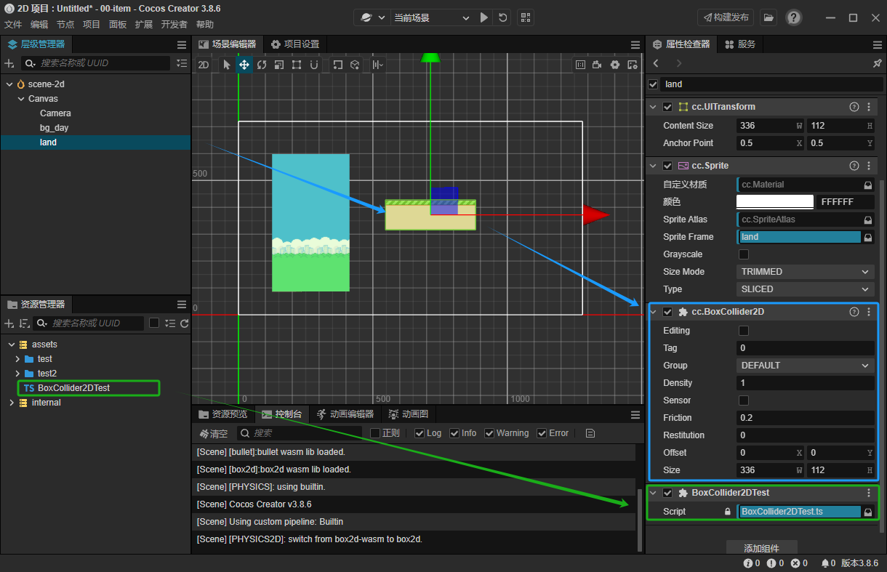

3. 脚本

    ```ts
    import { _decorator, Component, Collider2D,BoxCollider2D,Contact2DType,IPhysics2DContact,PhysicsSystem2D ,find} from 'cc';
    const { ccclass, property } = _decorator;

    @ccclass('BoxCollider2DTest')
    export class BoxCollider2DTest extends Component {
        start() {
            console.log("物理系统是否启用:", PhysicsSystem2D.instance.enable); // 应为 true

            let collider = this.node.getComponent(Collider2D);
            console.log("当前节点是否激活:", this.node.active);
            console.log("当前节点碰撞体是否启用:", collider?.enabled);

            let otherNoe  =  find("Canvas/bg_day")
            let otherCollider  = otherNoe.getComponent(Collider2D);
            console.log("目标节点是否激活:", otherNoe.active);
            console.log("目标节点碰撞体是否启用:", otherCollider.enabled);


            collider.on(Contact2DType.BEGIN_CONTACT, this.onBeginContact, this);
            collider.on(Contact2DType.END_CONTACT, this.onEndContact, this);

            otherCollider.on(Contact2DType.BEGIN_CONTACT,function(selfCollider: Collider2D, otherCollider: Collider2D){
                console.log("目标节点-检测到碰撞");
            });
            otherCollider.on(Contact2DType.END_CONTACT, function(selfCollider: Collider2D, otherCollider: Collider2D){
                console.log("目标节点-离开碰撞区域");
            })
        }

        onBeginContact (selfCollider: Collider2D, otherCollider: Collider2D, contact: IPhysics2DContact | null) {
            // 只在两个碰撞体开始接触时被调用一次
            console.log('当前节点-检测到碰撞');
        }
        onEndContact (selfCollider: Collider2D, otherCollider: Collider2D, contact: IPhysics2DContact | null) {
            // 只在两个碰撞体结束接触时被调用一次
            console.log('当前节点-离开碰撞区域');
        }

        update() {
        this.node.setPosition(this.node.x -5,this.node.y);
        }
    }
    ```

4. 运行结果

    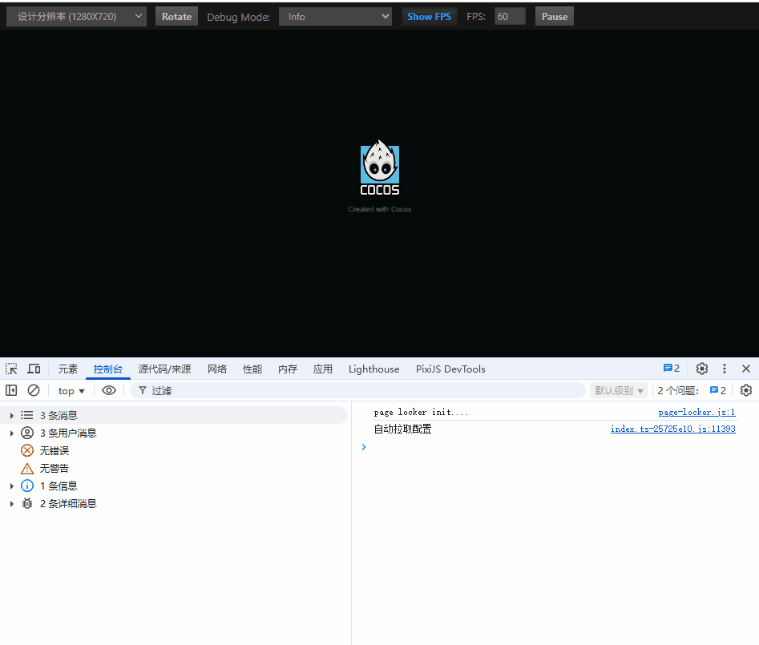

## 3.2 飞机大战练习

1. 调整画布大小

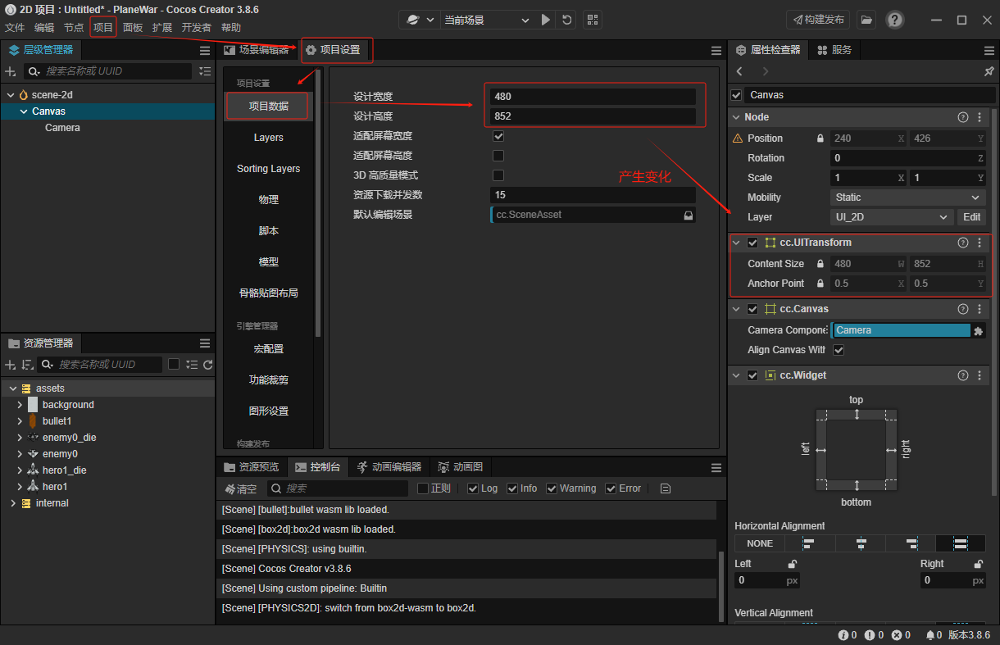

2. 背景图片循环播放

    - 实现循环播放方式：
        
    两张图片不断交替向下滚动

    - 界面设置

    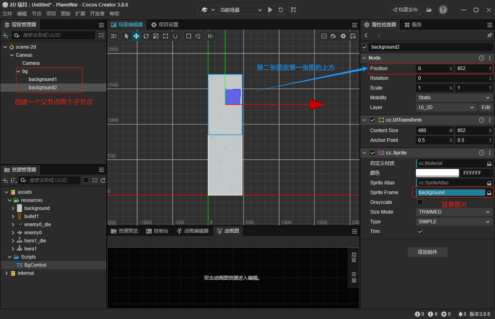

    - 父节点脚本

    ```ts
    import { _decorator, Component, Node } from 'cc';
    const { ccclass, property } = _decorator;

    @ccclass('BgControl')
    export class BgControl extends Component {
        start() {

        }

        update(deltaTime: number) {
            // 移动
            // 遍历子物体
            for (const bgNode of this.node.children) {
                // 移动 帧 -> 秒
                // deltaTime 两帧的间隔，
                // 一秒钟可以分为多个不同的deltaTime,他们加起来肯定也等于1
                bgNode.y -= 200 * deltaTime

                // 第一张图片加载完，重新设置高度
                if( bgNode.y < -850){
                    bgNode.y += 852 * 2
                }
            }

        }
    }
    ```

    - 结果展示

    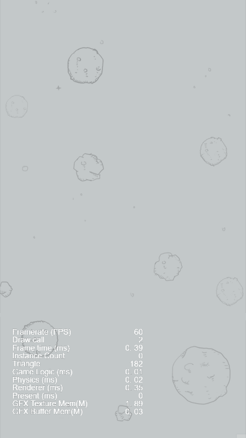

3. 飞机移动

    - 新建飞机节点与脚本

    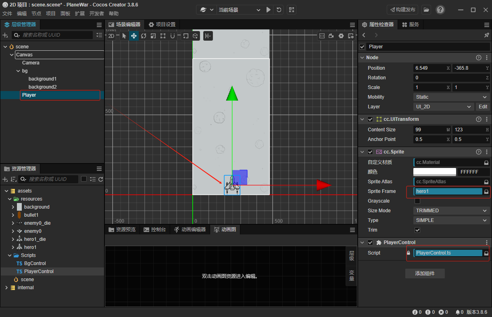

    - 编写脚本

    ```ts
    import { _decorator, Component, EventTouch, Input,find,UITransform} from 'cc';
    const { ccclass, property } = _decorator;

    @ccclass('PlayerControl')
    export class PlayerControl extends Component {
        start() {
            // 获取canvas
            const cut = find("Canvas").getComponent(UITransform);
            // const sut = this.node.getComponent(UITransform);

            // 移动
            this.node.on(Input.EventType.TOUCH_MOVE,  (event: EventTouch) =>{
                let location = event.getLocation();

                // 需要减去项目设置的锚点与原点的距离
                let moveX = location.x - cut.width * cut.anchorX 
                let moveY = location.y - cut.height * cut.anchorY 
                
                this.node.setPosition(moveX,moveY)
            })
        }

        update(deltaTime: number) {
            
        }
    }
    ```

    - 运行结果

    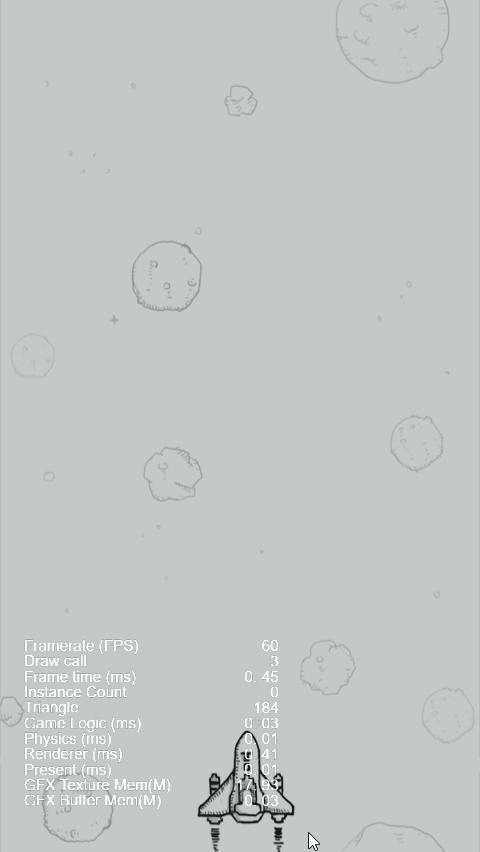

3. 子弹

    - 创建预设体

    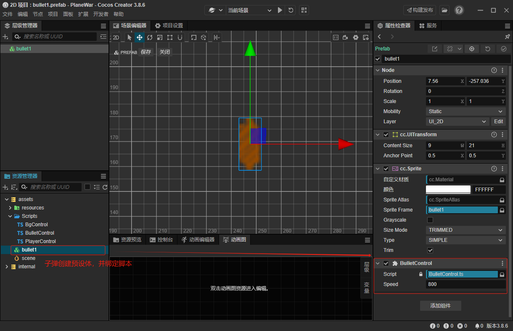

    - 预设体脚本

    ```ts
    import { _decorator, Component, Node } from 'cc';
    const { ccclass, property } = _decorator;

    @ccclass('BulletControl')
    export class BulletControl extends Component {

        @property
        speed:number = 800

        start() {

        }

        update(deltaTime: number) {
            // 移动
            this.node.y += this.speed * deltaTime
            // 移除屏幕销毁
            if(this.node.y > 820){
                this.node.destroy()
            }
        }
    }
    ```
  
    - 玩家脚本

    ```ts{26-35}
    import { _decorator, Component, EventTouch,Input,find,UITransform,Prefab,instantiate} from 'cc';
    const { ccclass, property } = _decorator;

    @ccclass('PlayerControl')
    export class PlayerControl extends Component {

        @property({ type: Prefab })
        bulletPre: Prefab ;

        start() {
            // 获取canvas
            const cut = find("Canvas").getComponent(UITransform);
            const sut = this.node.getComponent(UITransform);

            // 移动
            this.node.on(Input.EventType.TOUCH_MOVE,  (event: EventTouch) =>{
                let location = event.getLocation();

                // 需要减去项目设置的锚点与原点的距离
                let moveX = location.x - cut.width * cut.anchorX 
                let moveY = location.y - cut.height * cut.anchorY 
                
                this.node.setPosition(moveX,moveY)
            })

            // 攻击 计时器
            this.schedule(()=>{
                // 创建子弹
                let bullet = instantiate(this.bulletPre);
                // 设置父物体 当前场景
                bullet.setParent(find("Canvas"));
                // 设置子弹位置
                bullet.x = this.node.x;
                bullet.y = this.node.y + sut.height * sut.anchorY;
            },0.5)
        }

        update(deltaTime: number) {
            
        }
    }
    ```

    - 界面上 挂载 子弹预设体

    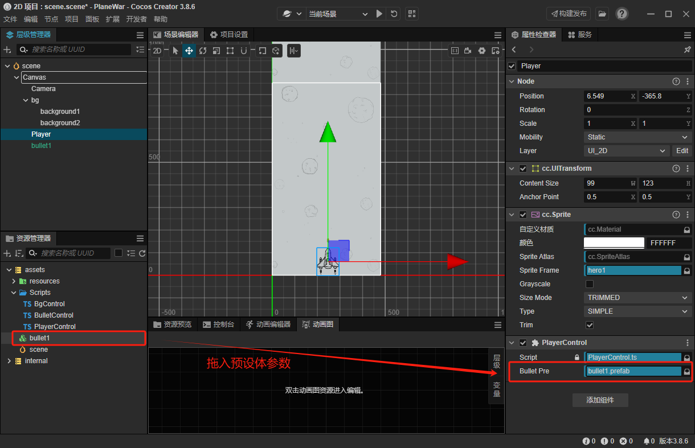

    - 运行结果

    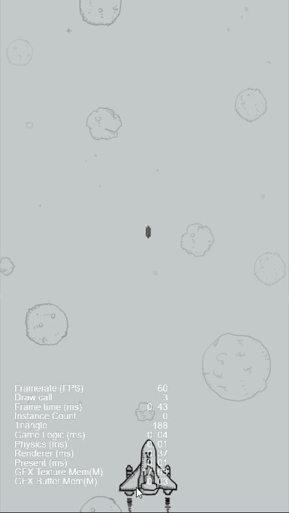

4. 敌人

    1. 敌人类

        - 创建敌人预设体

        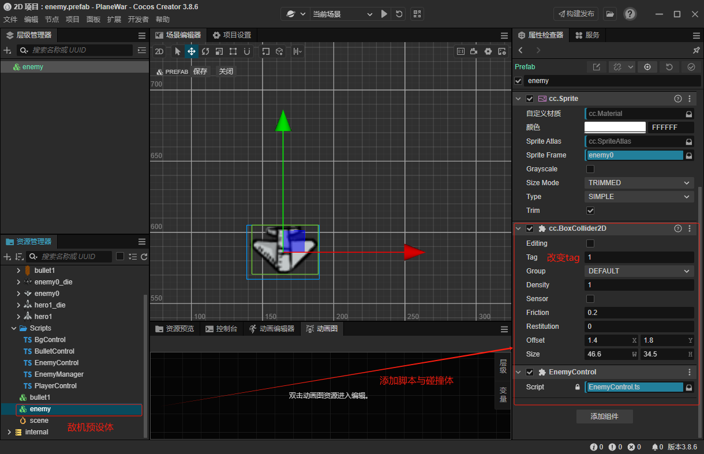

        - 敌人脚本

        ```ts
        import { _decorator, Component, resources ,SpriteFrame,Sprite} from 'cc';
        const { ccclass, property } = _decorator;

        @ccclass('EnemyControl')
        export class EnemyControl extends Component {

            // 是否死亡
            isDie: boolean = true;

            start() {

            }

            update(deltaTime: number) {
                // 移动
                if(this.isDie){
                    this.node.y -= 300 * deltaTime;
                }
                // 到底部
                if(this.node.y < - 500){
                    this.die()
                    this.isDie = false
                }
            }

            die(){
                // 加载爆炸图片
                resources.load("enemy0_die/spriteFrame", SpriteFrame, (err, sf) => {
                    const sprite = this.getComponent(Sprite);
                    sprite.spriteFrame = sf;
                });

                // 300毫秒销毁
                setTimeout(() => {
                    this.node?.destroy();
                }, 300);  
            }
        }
        ```
    2. 敌人管理类

        - 界面设置

        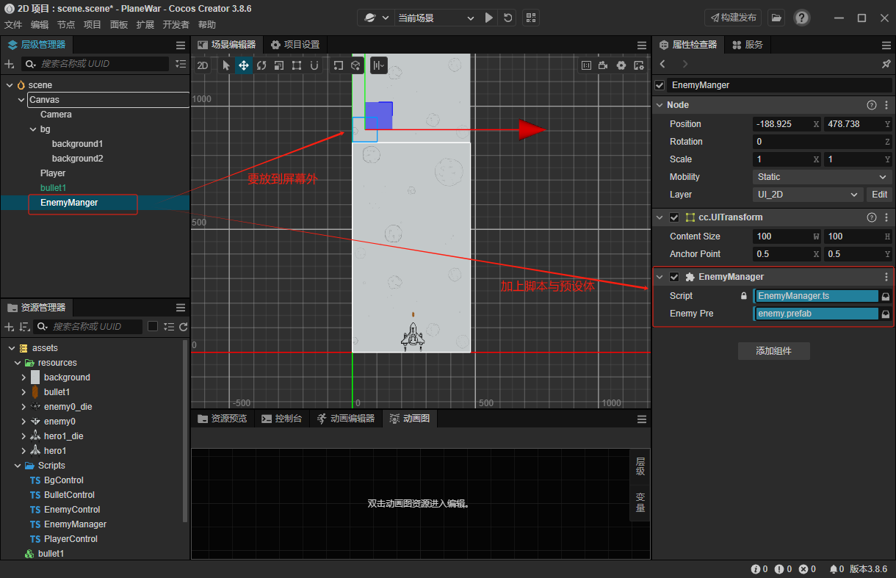

        - 脚本

        ```ts
        import { _decorator, Component, instantiate, find, Prefab } from 'cc';
        const { ccclass, property } = _decorator;

        @ccclass('EnemyManager')
        export class EnemyManager extends Component {

            // 敌机预设体
            @property({type:Prefab})
            enemyPre: Prefab = null

            start() {
                // 每隔2s,创建一个敌机
                this.schedule(()=>{
                    // 创建敌机
                    let enemy = instantiate(this.enemyPre);
                    enemy.setParent(find("Canvas"));
                    enemy.y = this.node.y;
                    enemy.x =  Math.random() * 400 + 20;
                },1)
            }

            update(deltaTime: number) {
                
            }
        }

        ```

    3. 碰撞类效果展示

        - 碰到子弹会销毁 

        BulletControl.ts

        ```ts{12-13,25-33}
        import { _decorator, Component, Collider2D,Contact2DType } from 'cc';
        import { EnemyControl } from './EnemyControl';
        const { ccclass, property } = _decorator;

        @ccclass('BulletControl')
        export class BulletControl extends Component {

            @property
            speed:number = 800

            start() {
                let collider = this.node.getComponent(Collider2D);
                collider.on(Contact2DType.BEGIN_CONTACT, this.onBeginContact, this);
            }

            update(deltaTime: number) {
                // 移动
                this.node.y += this.speed * deltaTime
                // 移除屏幕销毁
                if(this.node.y > 820){
                    this.node.destroy()
                }
            }

            onBeginContact(selfCollider: Collider2D, otherCollider: Collider2D){
                // 如果碰到敌人，销毁自己，让敌人死亡
                if(otherCollider.tag == 1){
                    // 销毁敌人 通知敌人销毁
                    otherCollider.getComponent(EnemyControl).die();
                    // 销毁自己
                    this.node.destroy()
                }
            }
        }
        ```

        - 玩家飞机会销毁 PlayerControl.ts

        ```ts{39-41,44-58}
        import { _decorator, Component,Input,EventTouch,find,UITransform,Prefab,instantiate} from 'cc';
        import { Collider2D,Contact2DType,resources,SpriteFrame,Sprite,director} from 'cc';
        import { EnemyControl } from './EnemyControl';

        const { ccclass, property } = _decorator;

        @ccclass('PlayerControl')
        export class PlayerControl extends Component {

            @property({ type: Prefab })
            bulletPre: Prefab ;

            start() {
                // 获取canvas
                const cut = find("Canvas").getComponent(UITransform);
                const sut = this.node.getComponent(UITransform);

                // 移动
                this.node.on(Input.EventType.TOUCH_MOVE,  (event: EventTouch) =>{
                    let location = event.getLocation();

                    // 需要减去项目设置的锚点与原点的距离
                    let moveX = location.x - cut.width * cut.anchorX 
                    let moveY = location.y - cut.height * cut.anchorY 
                    this.node.setPosition(moveX,moveY)
                })

                // 攻击 计时器
                this.schedule(()=>{
                    // 创建子弹
                    let bullet = instantiate(this.bulletPre);
                    // 设置父物体 当前场景
                    bullet.setParent(find("Canvas"));
                    // 设置子弹位置
                    bullet.x = this.node.x;
                    bullet.y = this.node.y + sut.height * sut.anchorY;
                },0.5)

                // 监听碰撞
                let collider = this.node.getComponent(Collider2D);
                collider.on(Contact2DType.BEGIN_CONTACT, this.onBeginContact, this);
            }

            onBeginContact(selfCollider: Collider2D, otherCollider: Collider2D){
                // 如果碰到敌人，销毁自己，让敌人死亡
                if(otherCollider.tag == 1){
                    // 销毁敌人 通知敌人销毁
                    otherCollider.getComponent(EnemyControl).die();
                    // 加载资源
                    resources.load("hero1_die/spriteFrame", SpriteFrame, (err, sf) => {
                        const sprite = this.getComponent(Sprite);
                        sprite.spriteFrame = sf;
                    });
                    // 直接游戏结束  暂停游戏逻辑 关闭监听事件
                    director.pause();
                    this.node.off(Input.EventType.TOUCH_MOVE)
                }
            }


            update(deltaTime: number) {
                
            }
        }
        ```

    4. 运行结果

        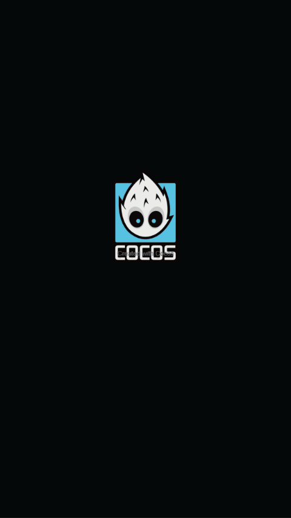

## 3.3 物理系统

### 3.3.1 刚体

刚体是组成物理世界的基本对象，可以将刚体想象成一个你不能看到（绘制）也不能摸到（碰撞）的且不能变形的物体。


1. 添加组件-> `RigidBody2D`

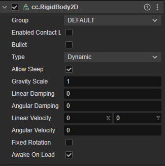

| 属性    | 说明   |
|---------|--------|
| Group  | 刚体的分组。通过 碰撞矩阵 可设置不同分组间碰撞的可能性       |
| EnabledContactListener | 开启监听碰撞回调       |
| Bullet  | 这个刚体是否是一个快速移动的刚体，并且需要禁止穿过其他快速移动的刚体 |
| Type  | 刚体类型                |
| AllowSleep  | 是否允许刚体休眠   |
| GravityScale | 重力缩放比例 <br> 仅对 Dynamic 类型的刚体生效   |
| LinearDamping   | 移动速度衰减系数  |
| AngularDamping  | 旋转速度衰减系数  |
| LinearVelocity  | 移动速度<br>仅对 Dynamic 和 Kinematic 类型的刚体生效  |
| AngularVelocity | 旋转速度<br>仅对 Dynamic 和 Kinematic 类型的刚体生效   |
| FixedRotation   | 是否固定旋转   |
| AwakeOnLoad     | 加载完成后立刻唤醒刚体    |


| 刚体类型      | 说明                                                                   |
|-----------|----------------------------------------------------------------------|
| Static    | 静态刚体，零质量，零速度，即不会受到重力或速度影响，但是可以设置他的位置来进行移动。该类型通常用于制作场景                |
| Dynamic   | 动态刚体，有质量，可以设置速度，会受到重力影响。唯一可以通过 applyForce 和 applyTorque 等方法改变受力的刚体类型 |
| Kinematic | 运动刚体，零质量，可以设置速度，不会受到重力的影响，但是可以设置速度来进行移动                              |
| Animated  | 动画刚体，在上面已经提到过，从 Kinematic 衍生的类型，主要用于刚体与动画编辑结合使用                      |


2. 刚体界面使用

    - 参考背景图

    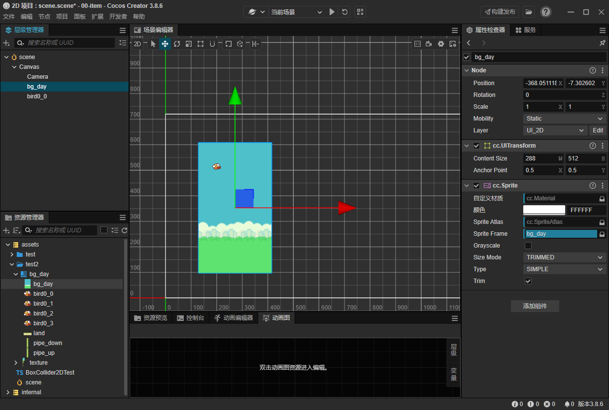

    - 小鸟刚体

    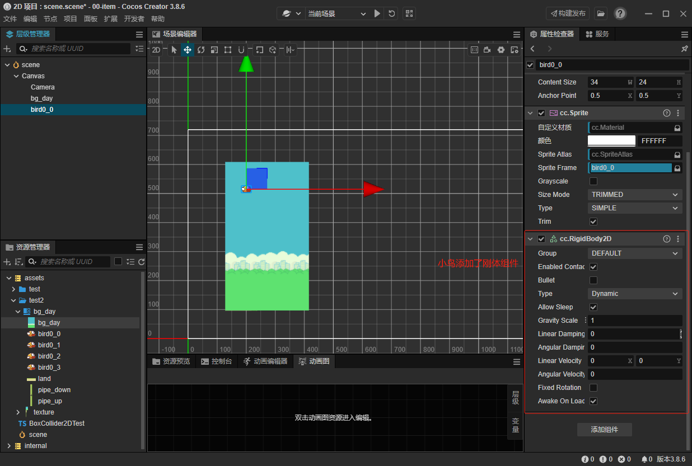

    - 修改物理系统 `Box2D`

    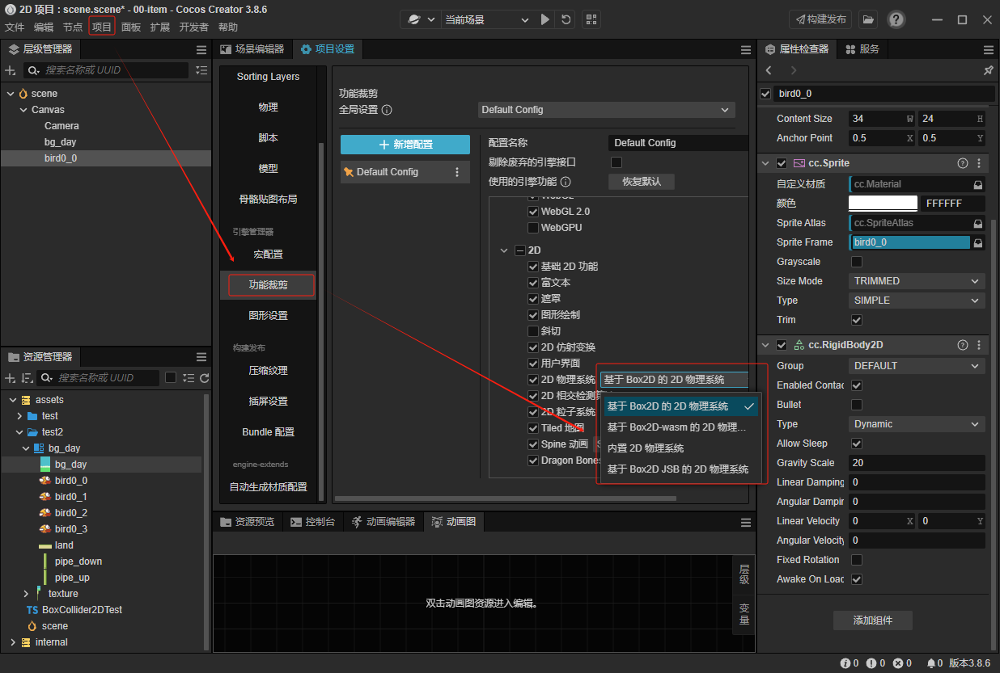

    - 基础运行结果

    

    - 修改重力 `GravityScale: 0.5`

    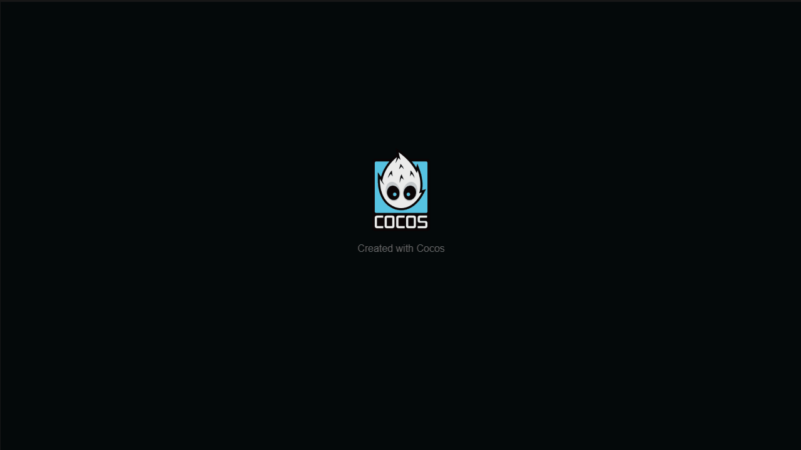

    - 修改初速度 `LinearVelocity:{x:10,y:0}`

    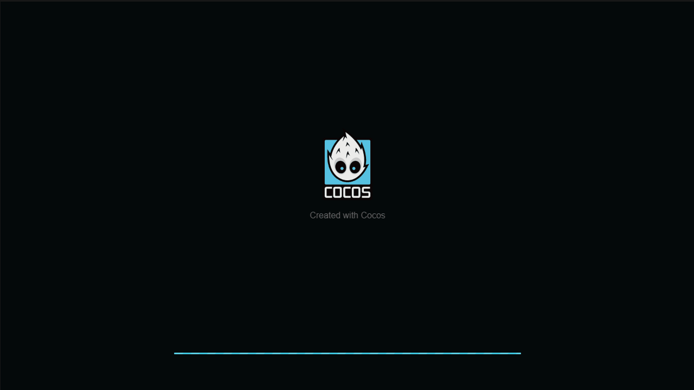

    - 修改旋转速度 `AngularVelocity:10`

    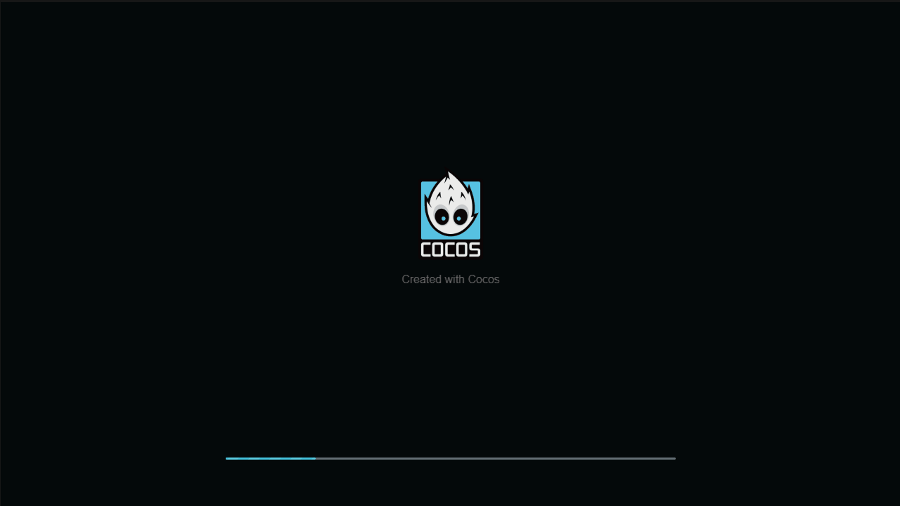


### 3.3.2 物理碰撞

1. 刚体获取物理特性 

    - 获取刚体

    ```ts
    // 获取刚体
    let rigidbody =  this.getComponent(RigidBody2D);
    ```

    - 使用 `applyForce` 
        - 代码

        ```ts
        // 方向上的作用力 作用到节点上的点
        rigidbody.applyForce(v2(300,0),v2(0,0),true)
        ```
        - 运行结果
        
        

    - 使用 `applyForceToCenter`

        - 代码

        ```ts
        // 方向上的作用力 
        rigidbody.applyForceToCenter(v2(300,0),true)
        ```
        - 运行结果
        
        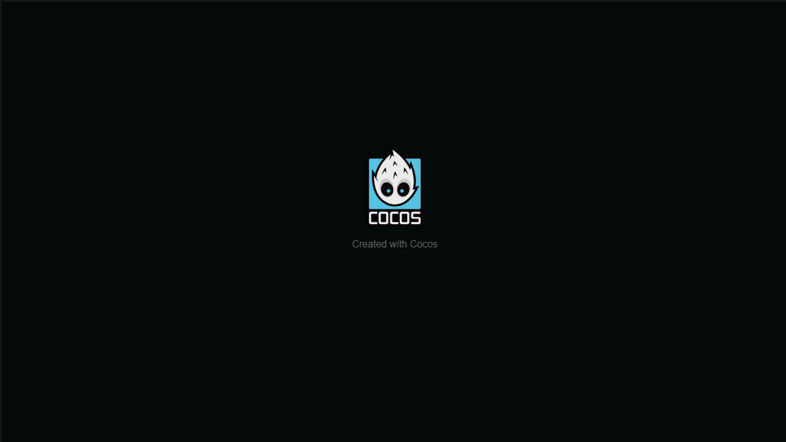


    - 初速度

        - 代码

        ```ts
        // 物体的初速度
        rigidbody.linearVelocity = v2(3,0)
        ```

        - 运行结果
        
        

2. 物体碰撞

    - 设定陆地,拥有刚体以及检测体

    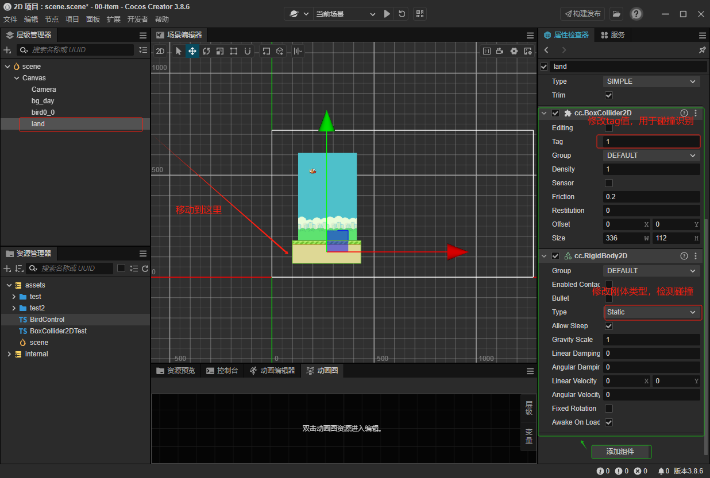

    - 设定小鸟

    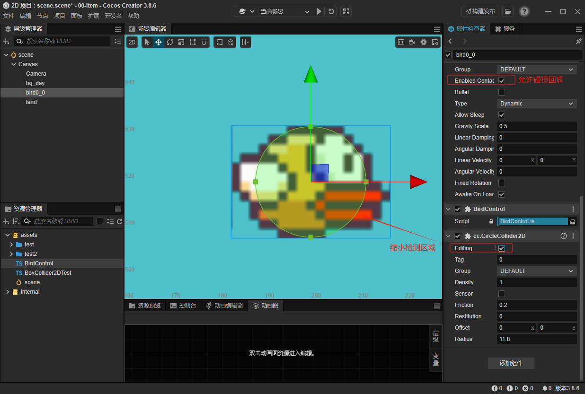

    - 运行结果

    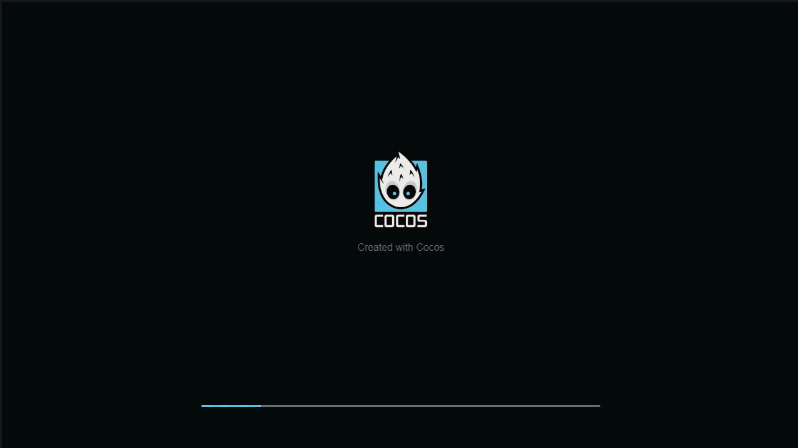

    - 脚本中使用回调

    ```ts{19-22,25-40}
    import { _decorator, Component, v2 } from "cc";
    import {RigidBody2D, Collider2D, Contact2DType, IPhysics2DContact } from "cc";

    const { ccclass, property } = _decorator;

    @ccclass("BirdControl")
    export class BirdControl extends Component {
        start() {
            // 获取刚体
            let rigidbody = this.getComponent(RigidBody2D);

            // 力
            // rigidbody.applyForce(v2(300,0),v2(0,0),true)
            // rigidbody.applyForceToCenter(v2(300,0),true)

            // 速度
            rigidbody.linearVelocity = v2(3, 0);

            // 碰撞体
            let collider = this.node.getComponent(Collider2D);
            collider.on(Contact2DType.BEGIN_CONTACT, this.onBeginContact, this);
            collider.on(Contact2DType.END_CONTACT, this.onEndContact, this);
        }

        // 开始碰撞
        onBeginContact(self: Collider2D, other: Collider2D,contact: IPhysics2DContact | null) {
            console.log("检测到碰撞");
            // 得到碰撞点 数组类型
            let points =  contact.getWorldManifold().points
            console.log(points[0]);
            // 得到法线信息
            // 法线垂直于平面的线
            let normal = contact.getWorldManifold().normal
            console.log(normal);
            
        }
        // 结束碰撞
        onEndContact(selfCollider: Collider2D, otherCollider: Collider2D) {
            console.log("离开碰撞区域");
        }
    }
    ```

    - 允许结果

    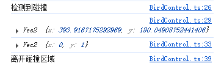


### 3.3.3 传感器

1. 精灵取消显示，且勾选上传感器

    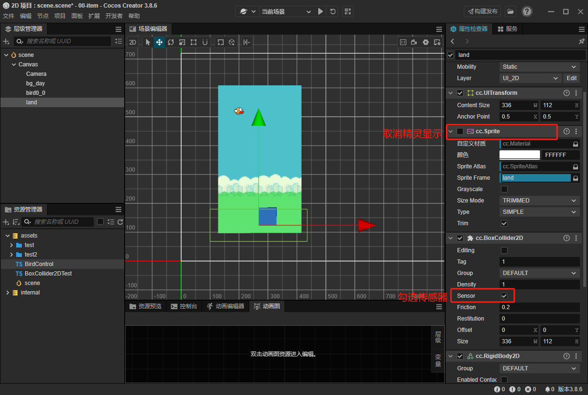

2. 页面效果

    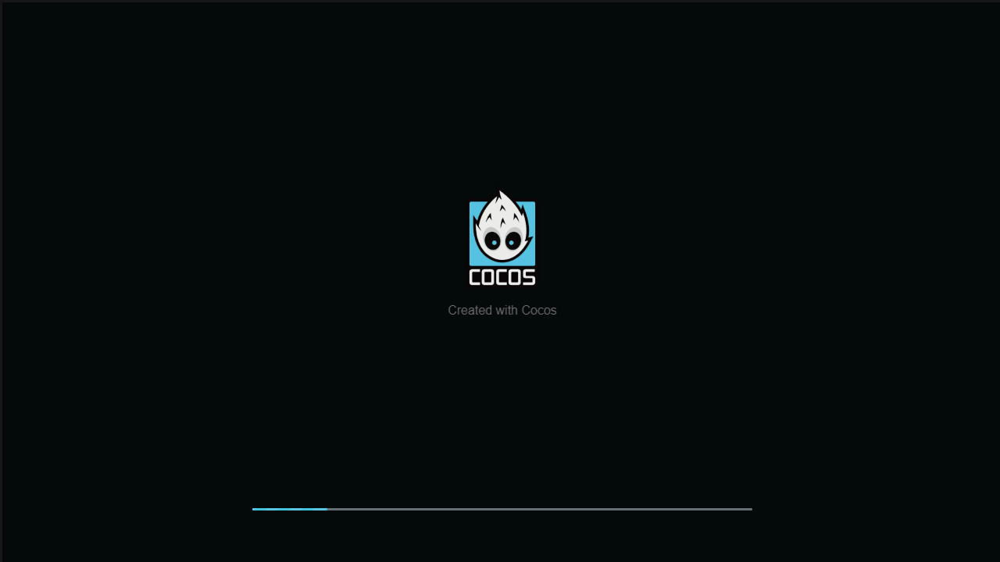

3. 运行结果

    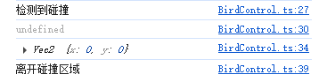

    可以看出 依然会碰撞，但是没有碰撞点，且法线没有意义了

### 3.3.4 射线

1. 射线写法

    - 代码
        ```ts
        const results = PhysicsSystem2D.instance.raycast(p1, p2, type, mask);

        for (let i = 0; i < results.length; i++) {
            const result = results[i];
            const collider = result.collider;
            const point = result.point;
            const normal = result.normal;
            const fraction = result.fraction;
        }
        ```

    - 射线长度 p1 到 p2 点的线
    - type 类型
        - ERaycast2DType.Any：检测射线路径上任意的碰撞体，一旦检测到任何碰撞体，将立刻结束检测其他的碰撞体，最快。
        - ERaycast2DType.Closest：检测射线路径上最近的碰撞体，这是射线检测的默认值，稍慢。
        - ERaycast2DType.All：检测射线路径上的所有碰撞体，检测到的结果顺序不是固定的。在这种检测类型下，一个碰撞体可能会返回多个结果，这是因为 Box2D 是通过检测夹具（fixture）来进行物体检测的，而一个碰撞体中可能由多个夹具（fixture）组成的，慢。
        - ERaycast2DType.AllClosest：检测射线路径上所有碰撞体，但是会对返回值进行删选，只返回每一个碰撞体距离射线起始点最近的那个点的相关信息，最慢。
    - 射线检测的结果
        - collider：指定射线穿过的是哪一个碰撞体。
        - point：指定射线与穿过的碰撞体在哪一点相交。
        - normal：指定碰撞体在相交点的表面的法线向量。
        - fraction：指定相交点在射线上的分数。

        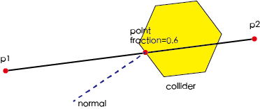
    
2. 射线小练习

    - 设置两堵墙

        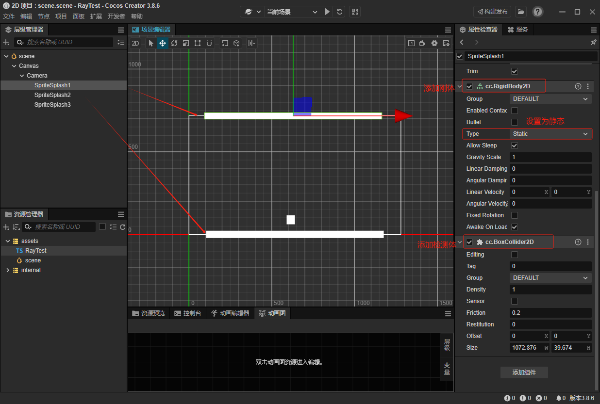
    
    - 设置巡逻物体（用于发送射线）

        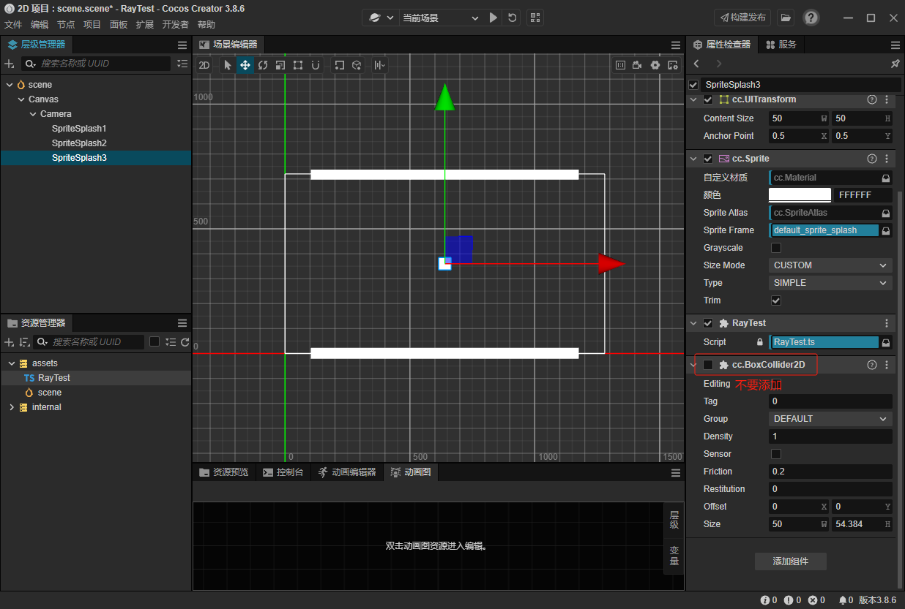

        > 注意： 千万不要添加碰撞体，否则巡逻物体移动后 依然会在原地留下碰撞体
    
    - 脚本

        ```ts
        import { _decorator, Component, Vec2,PhysicsSystem2D,ERaycast2DType,UITransform } from 'cc';
        const { ccclass, property } = _decorator;

        @ccclass('RayTest')
        export class RayTest extends Component {

            // 方向
            dir:Vec2 = new Vec2(0,1)

            update(deltaTime: number) {
                // 移动
                this.node.x += this.dir.x * 100 * deltaTime;
                this.node.y += this.dir.y * 100 * deltaTime;
                
                // 射线检测
                // 3.8 开始 射线检测要用世界坐标系
                let worldPoint =  this.node.getWorldPosition();
                let start = new Vec2( worldPoint.x  ,worldPoint.y);
                let end = new Vec2(start.x,start.y + this.dir.y * 80) // 射线的长度为80

                // 初始化射线
                let res =  PhysicsSystem2D.instance.raycast(
                    start,                  // 线的初始点位
                    end,                    // 线的结束点位
                    ERaycast2DType.Closest  // 检测类型：Closest 第一次碰到的点
                );
            
                if(res.length>0){
                    this.dir.y *= -1;
                }
            }
        }
        ```

    - 运行结果

        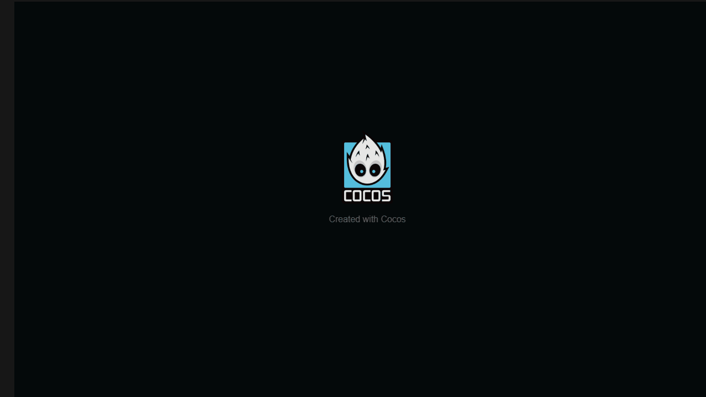

## 3.4 动作系统


1. 基础动作类型

    -  位移动作 (Move)

        ```ts
        // 移动到指定位置(绝对坐标)
        const moveTo = tween(this.node)
            .to(1, { position: new Vec3(100, 200, 0) })

        // 移动相对距离
        const moveBy = tween(this.node)
            .by(1, { position: new Vec3(50, 0, 0) })
        ```

    -  旋转动作 (Rotate)

        ```typescript
        // 旋转到指定角度
        const rotateTo = tween(this.node)
            .to(1, { eulerAngles: new Vec3(0, 0, 90) })

        // 旋转相对角度
        const rotateBy = tween(this.node)
            .by(1, { eulerAngles: new Vec3(0, 180, 0) })
        ```

    -  缩放动作 (Scale)

        ```typescript
        // 缩放到指定大小
        const scaleTo = tween(this.node)
            .to(1, { scale: new Vec3(2, 2, 1) })

        // 相对缩放
        const scaleBy = tween(this.node)
            .by(1, { scale: new Vec3(0.5, 0.5, 0) })
        ```

2. 复合动作
    - 顺序执行 (Sequence)

        ```typescript
        tween(this.node)
            .sequence(
                tween().to(1, { position: new Vec3(100, 0, 0) }),
                tween().to(1, { position: new Vec3(100, 100, 0) }),
                tween().to(1, { position: new Vec3(0, 100, 0) }),
                tween().to(1, { position: new Vec3(0, 0, 0) })
            )
            .start()
        ```

    - 同时执行 (Parallel)

        ```typescript
        tween(this.node)
            .parallel(
                tween().to(2, { position: new Vec3(200, 0, 0) }),
                tween().to(1, { scale: new Vec3(2, 2, 1) }),
                tween().to(2, { eulerAngles: new Vec3(0, 0, 360) })
            )
            .start()
        ```

3. 缓动效果 (Easing)

    - Cocos Creator 提供了多种缓动函数：

    ```typescript
    import { tween, Easing } from 'cc'

    tween(this.node)
        .to(1, { position: new Vec3(200, 0, 0) }, { easing: Easing.QuadInOut })
        .start()
    ```

    - 常用缓动函数：

        *   `Easing.QuadIn` - 加速
        *   `Easing.QuadOut` - 减速
        *   `Easing.QuadInOut` - 先加速后减速
        *   `Easing.ElasticIn` - 弹性效果
        *   `Easing.BounceOut` - 弹跳效果
            

4. 回调与事件

    - 动作回调

        ```typescript
        tween(this.node)
            .to(1, { position: new Vec3(100, 0, 0) })
            .call(() => {
                console.log('移动完成')
            })
            .start()
        ```

    - 自定义事件

        ```typescript
        tween(this.node)
            .to(1, { position: new Vec3(100, 0, 0) })
            .emit('moveComplete')
            .start()

        this.node.on('moveComplete', () => {
            console.log('接收到移动完成事件')
        })
        ```

5. 高级用法

    - 重复动作

        ```typescript
        // 重复3次
        tween(this.node)
            .repeat(3,
                tween()
                    .to(0.5, { scale: new Vec3(1.5, 1.5, 1) })
                    .to(0.5, { scale: new Vec3(1, 1, 1) })
            )
            .start()

        // 无限循环
        tween(this.node)
            .repeatForever(
                tween()
                    .to(1, { rotation: 180 })
                    .to(1, { rotation: 360 })
            )
            .start()
        ```

    - 延迟执行

        ```typescript
        tween(this.node)
            .delay(1) // 延迟1秒
            .to(1, { position: new Vec3(100, 0, 0) })
            .start()
        ```

    - 贝塞尔曲线运动

        ```typescript
        const bezier = [
            new Vec3(0, 0, 0),   // 起点
            new Vec3(100, 200, 0), // 控制点1
            new Vec3(200, 100, 0), // 控制点2
            new Vec3(300, 0, 0)    // 终点
        ]

        tween(this.node)
            .bezierTo(2, bezier)
            .start()
        ```

6. 动作控制

    - 停止动作

        ```typescript
        // 创建并保存tween对象
        const myTween = tween(this.node)
            .to(2, { position: new Vec3(200, 0, 0) })
            .start()

        // 停止动作
        myTween.stop()
        ```

    - 暂停/恢复

        ```typescript
        // 暂停所有动作
        tween(this.node).pauseAll()

        // 恢复所有动作
        tween(this.node).resumeAll()
        ```


7. 提供实现方法

    - 淡入淡出

        ```ts
        // 淡入显示
        showWithFade(node: Node, duration: number = 0.5) {
            node.active = true;
            const opacity = node.getComponent(UIOpacity) || node.addComponent(UIOpacity);
            opacity.opacity = 0;
            
            tween(opacity)
                .to(duration, { opacity: 255 })
                .start();
        }

        // 淡出隐藏
        hideWithFade(node: Node, duration: number = 0.5) {
            const opacity = node.getComponent(UIOpacity) || node.addComponent(UIOpacity);
            
            tween(opacity)
                .to(duration, { opacity: 0 })
                .call(() => node.active = false)
                .start();
        }
        ```
        
    - 缩放显示隐藏

        ```ts
        // 缩放显示
        showWithScale(node: Node, duration: number = 0.3) {
            node.active = true;
            node.setScale(0, 0, 0);
            
            tween(node)
                .to(duration, { scale: new Vec3(1, 1, 1) }, { easing: 'backOut' })
                .start();
        }

        // 缩放隐藏
        hideWithScale(node: Node, duration: number = 0.3) {
            tween(node)
                .to(duration, { scale: new Vec3(0, 0, 0) }, { easing: 'backIn' })
                .call(() => node.active = false)
                .start();
        }
        ```
        
    - 翻转动作
        - 水平翻转

            ```ts
            flipHorizontal(node: Node, duration: number = 0.5) {
                tween(node)
                    .to(duration/2, { scale: new Vec3(0, 1, 1) })
                    .to(duration/2, { scale: new Vec3(1, 1, 1) })
                    .start();
            }
            ```
        - 垂直翻转
        
            ```ts
           flipVertical(node: Node, duration: number = 0.5) {
                tween(node)
                    .to(duration/2, { scale: new Vec3(1, 0, 1) })
                    .to(duration/2, { scale: new Vec3(1, 1, 1) })
                    .start();
            }
            ```
        - 3D翻转效果
        
            ```ts
           flip3D(node: Node, duration: number = 0.8) {
                tween(node)
                    .to(duration/2, { eulerAngles: new Vec3(0, 90, 0) })
                    .call(() => {
                        // 这里可以更换显示内容
                    })
                    .to(duration/2, { eulerAngles: new Vec3(0, 0, 0) })
                    .start();
            }
            ```

## 3.5 动画系统


### 3.5.1 基础认识

1. 创建动画

    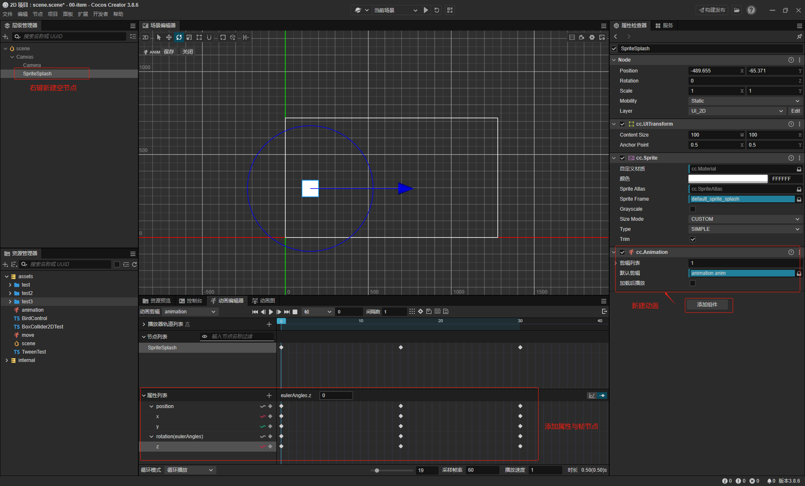

2. 动画编辑器菜单

    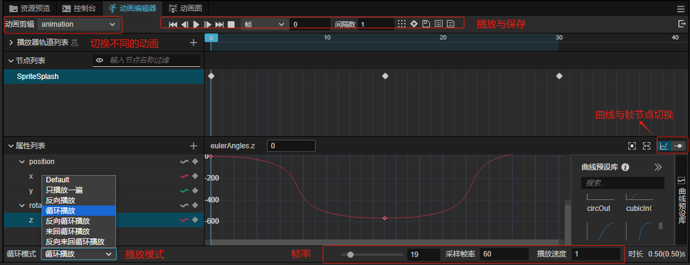

3. 运行结果

    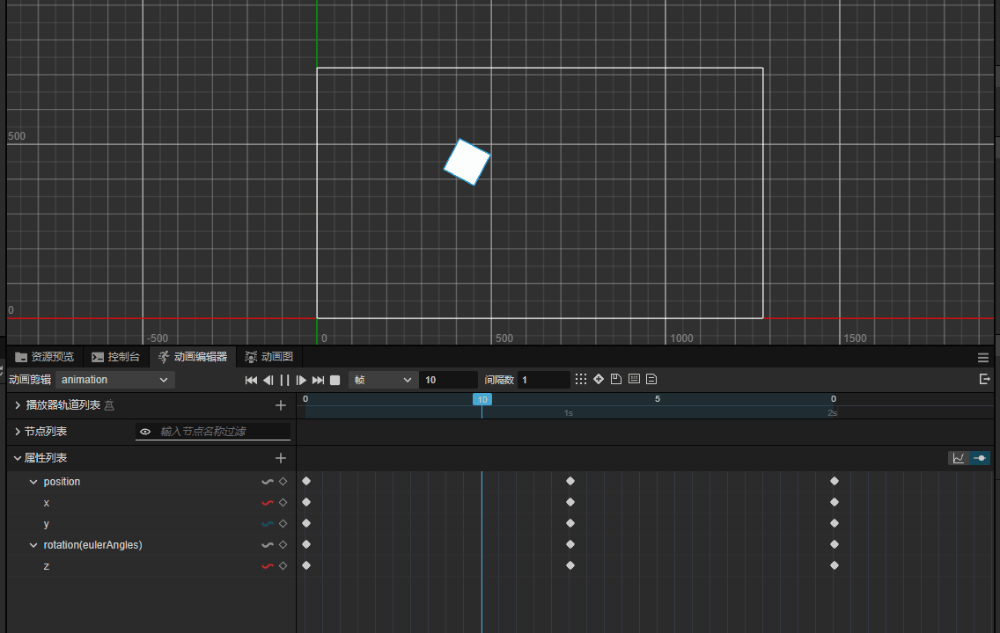

### 3.5.2 脚本相关


1. 插入帧事件

    - 界面操作

        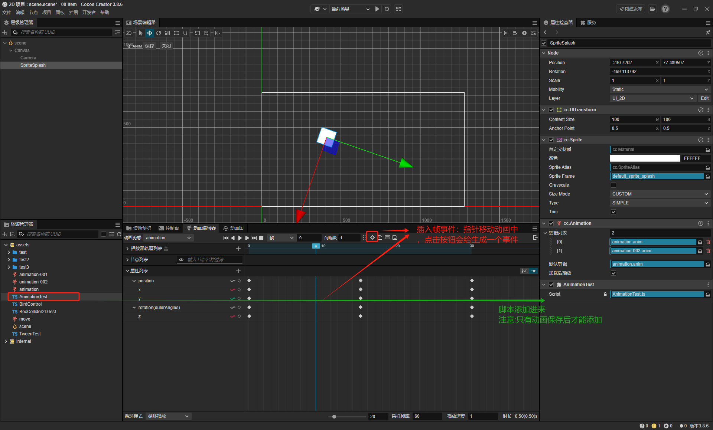

    - 双击新建的帧事件按钮

        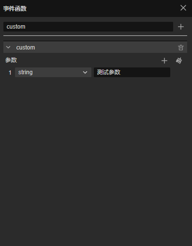
    
    - 脚本

        ```ts
       import { _decorator, Component, Node } from 'cc';
        const { ccclass, property } = _decorator;

        @ccclass('AnimationTest')
        export class AnimationTest extends Component {
            start() {

            }

            update(deltaTime: number) {
                
            }

            custom(param:string){
                console.log("被调用了,参数是：",param);
            }
            
        }
        ```
        
    - 运行结果

        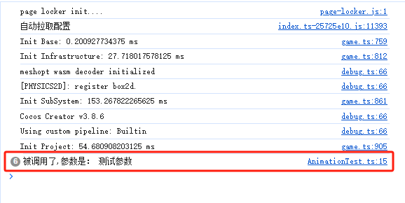
    

2. 控制动画播放

    ```ts
    import { _decorator, Animation, Component, Node } from 'cc';
    const { ccclass, property } = _decorator;

    @ccclass('AnimationTest')
    export class AnimationTest extends Component {
        start() {
            let ani = this.getComponent(Animation)
            // 播放
            ani.play()
            // 暂停
            ani.pause()
            // 恢复
            ani.resume()
            // 停止
            ani.stop()
        }

    }

    ```

### 3.5.3 关键帧动画

1. 添加动画组件、动画属性

    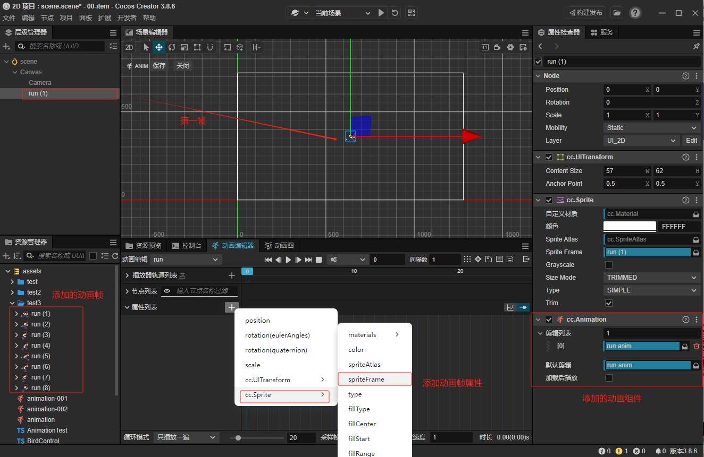

2. 关键帧图片突入新建属性中

    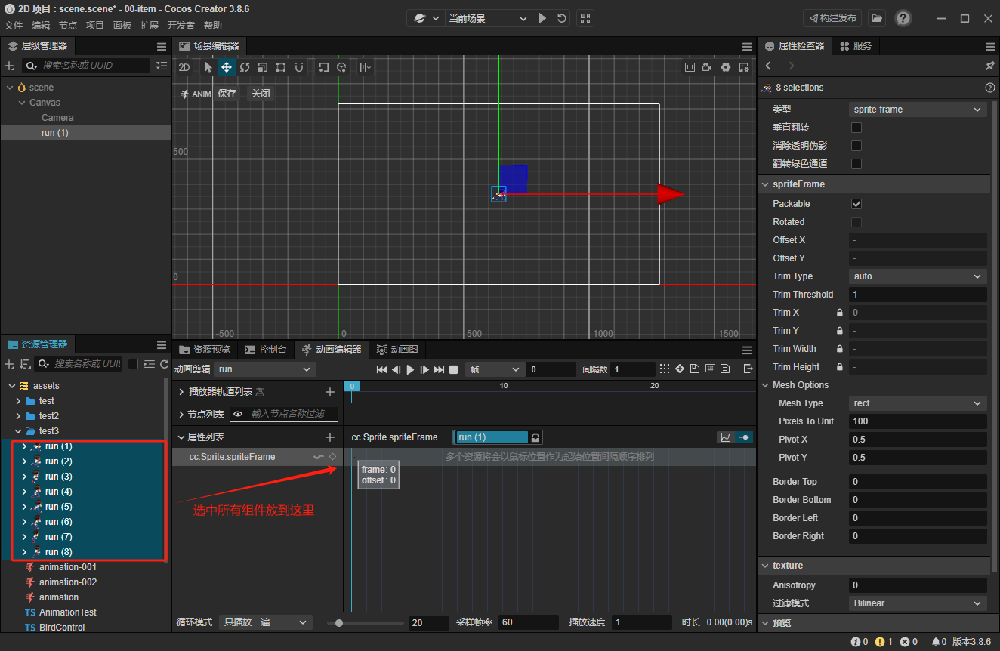

3. 运行结果

    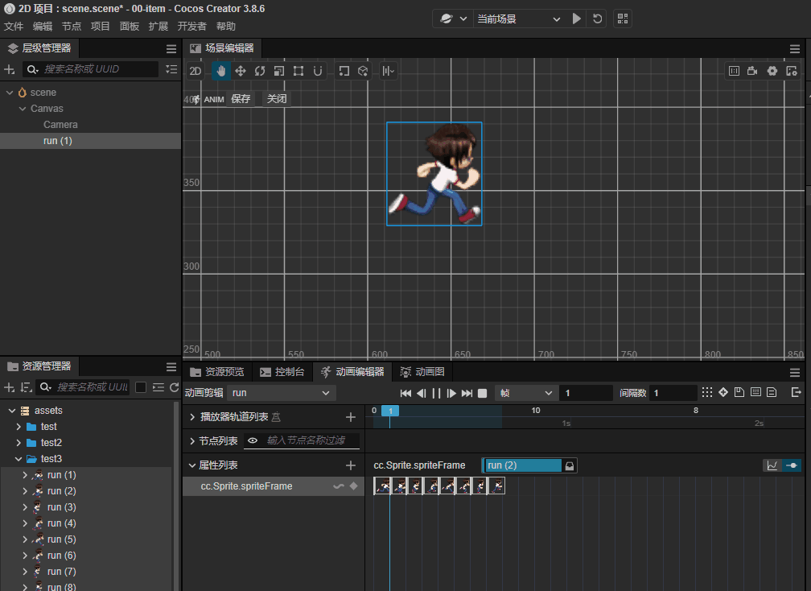

## 3.6 管道鸟练习

1. 添加资源与屏幕大小

    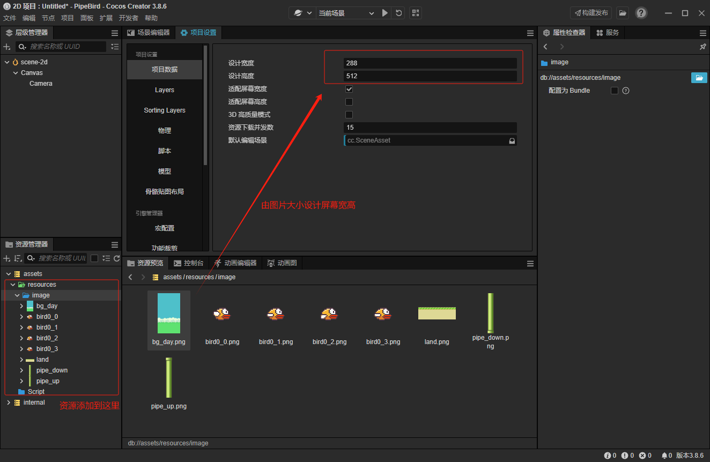

2. 背景设计

    - 背景图片结构设置

        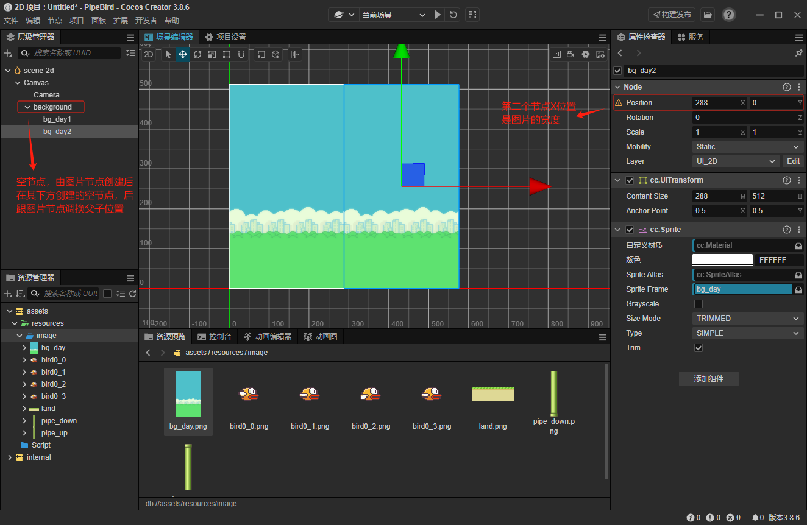

    - 父节点脚本设计

        ```ts
        import { _decorator, Component, Node } from 'cc';
        const { ccclass, property } = _decorator;

        @ccclass('BgControl')
        export class BgControl extends Component {

            // 速度
            @property
            speed:number = 4;

            // 宽度
            @property
            width:number = 288;

            start() {

            }

            update(deltaTime: number) {
                // 移动
                for (const bg of this.node.children) {
                    bg.x -= this.speed * deltaTime * 100;
                    // 如果背景超出
                    if(bg.x < -this.width){
                        bg.x += this.width * 2;
                    }
                }
            }
        }
        ```

    - 运行结果

        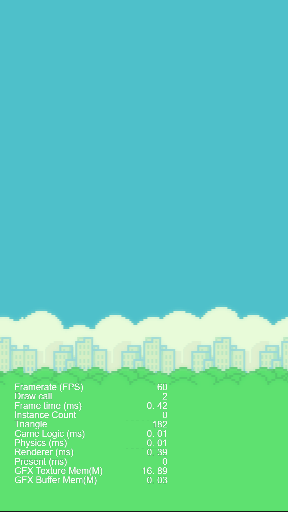


3. 陆地设计

    - 背景类似，也使用同样的脚本，传入不同的参数

        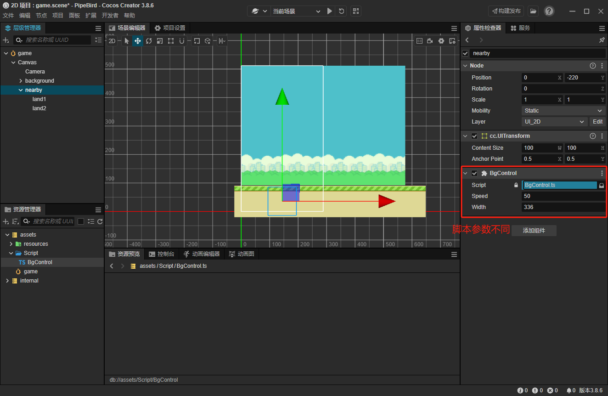

    - 运行结果

        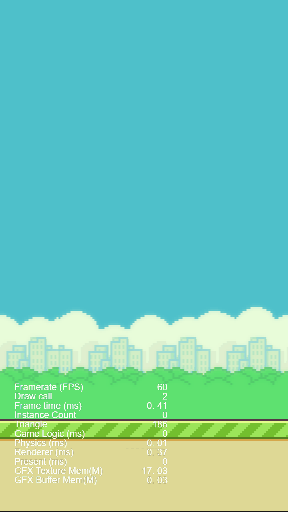

4. 小鸟设计

    - 小鸟节点创建于动画

        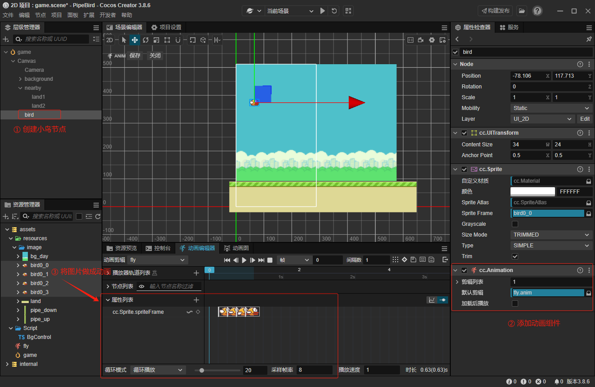

    - 设置小鸟刚体、碰撞体、脚本

        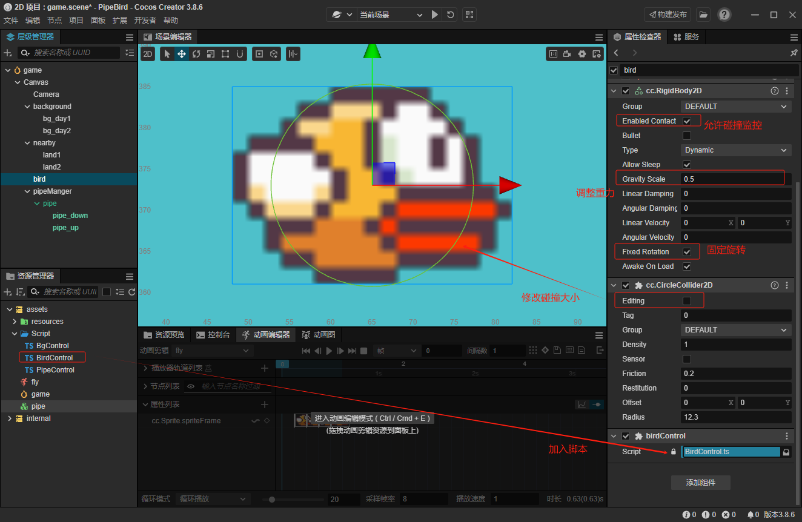

    - 小鸟脚本

        ```ts
        import { _decorator, Component, Animation, RigidBody2D, Vec2 } from 'cc';
        const { ccclass, property } = _decorator;

        @ccclass('birdControl')
        export class birdControl extends Component {
            start() {
                let ani = this.getComponent(Animation)
                // 播放
                ani.play()
            }

            // 飞
            fly(){
                let RigidBody = this.getComponent(RigidBody2D);
                // 设置向上的除速度
                RigidBody.linearVelocity = new Vec2(0,5);
            }

            update(deltaTime: number) {
                
            }
        }
        ```

    - 点击事件修改

        - 背景脚本修该

            ```ts
            import { _decorator, Component, Input } from 'cc';
            import { birdControl } from './BirdControl';
            const { ccclass, property } = _decorator;

            @ccclass('BgControl')
            export class BgControl extends Component {

                // 速度
                @property
                speed:number = 4;

                // 宽度
                @property
                width:number = 288;

                // 小鸟
                @property(birdControl)
                bird:birdControl = null;

                start() {
                    // 点击监听
                    for (const bg of this.node.children) {
                        bg.on(Input.EventType.TOUCH_START,()=>{
                            this.bird.fly()
                        })
                    }
                }

                update(deltaTime: number) {
                    // 移动
                    for (const bg of this.node.children) {
                        bg.x -= this.speed * deltaTime ;
                        // 如果背景超出
                        if(bg.x < -this.width){
                            bg.x += this.width * 2;
                        }
                    }
                }
            }
            ```
        - 界面参数设置

            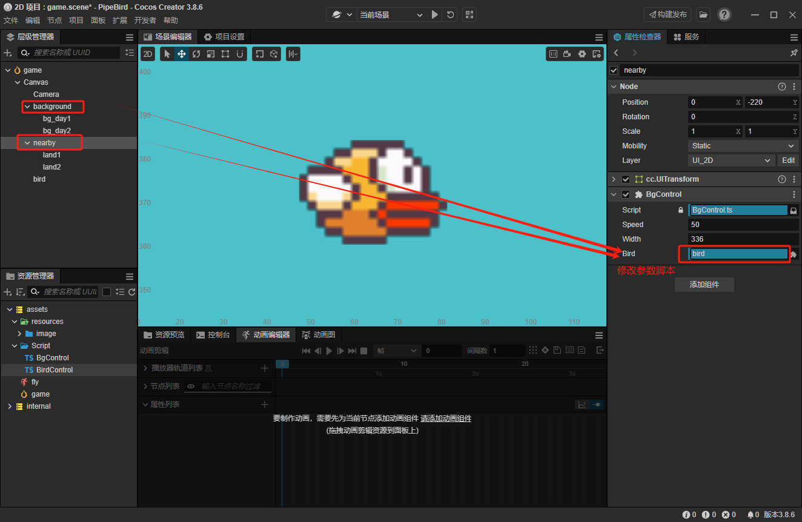

    - 陆地添加刚体、碰撞体

        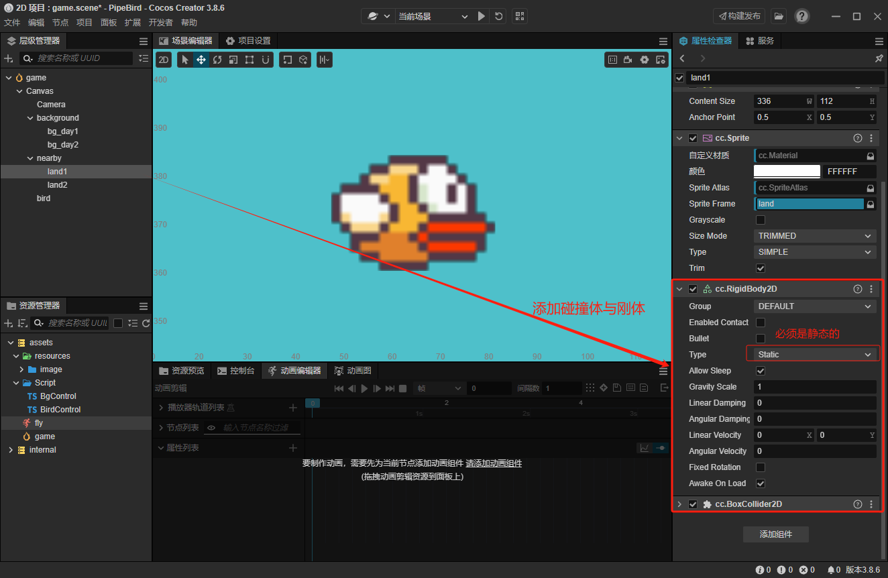 
    
    - 运行结果

        
5. 管道设计

    - 新建管理节点，用于一直添加上下管道

        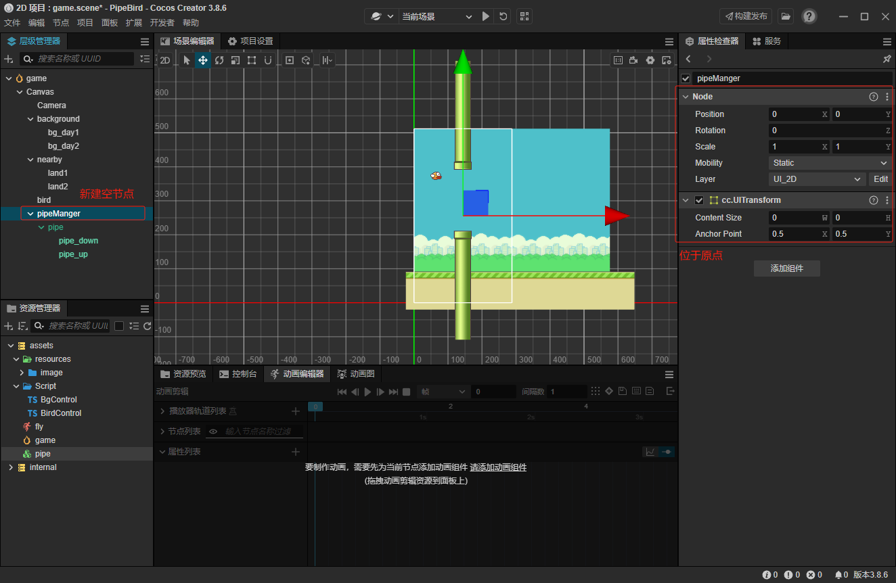

    - 新建预设体
        - 主节点

            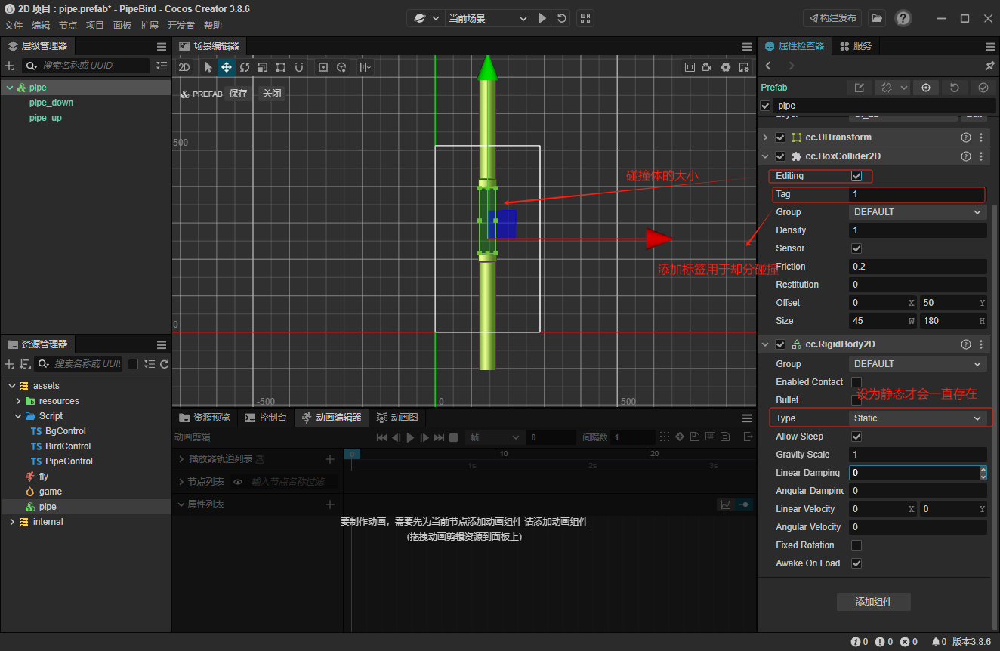
        - 子节点-上

            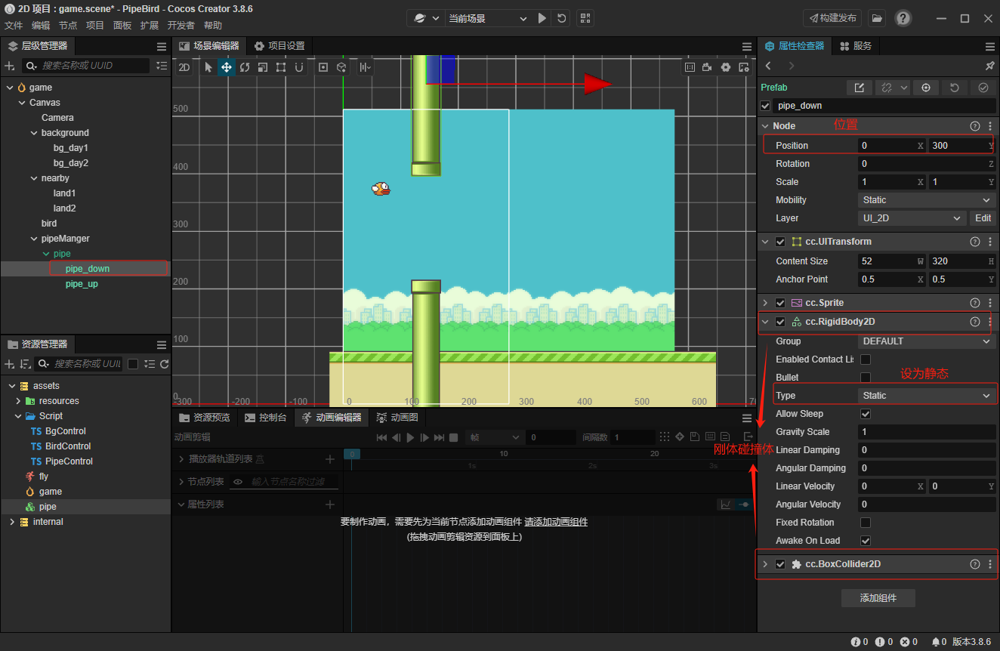
        - 子节点-下

            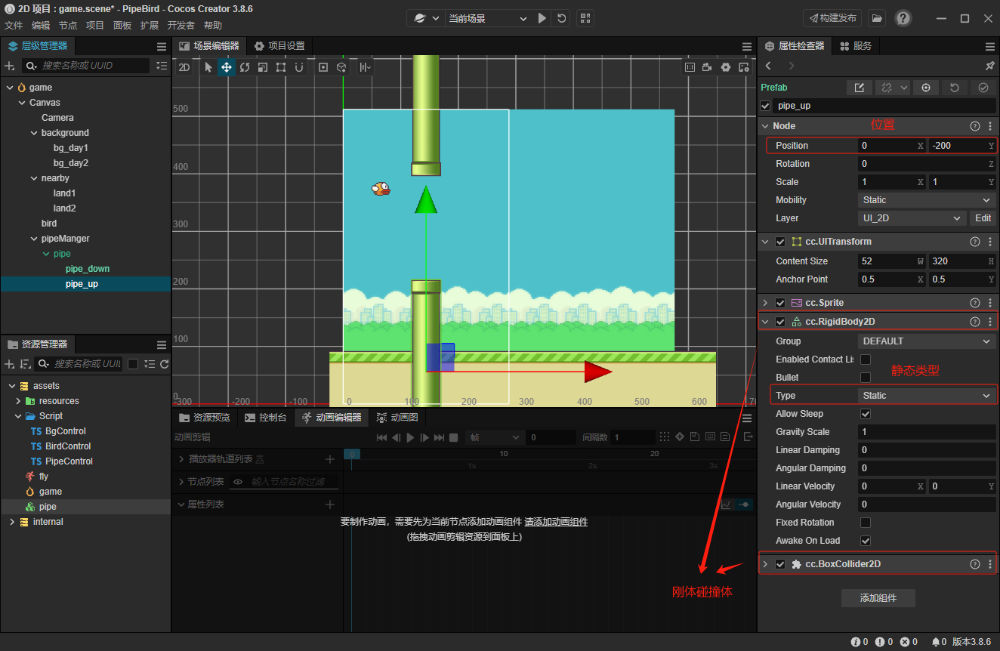

    - 管理管道节点脚本 PipeControl.ts

    ```ts
    import { _decorator, Component, Prefab,find,Size,instantiate,UITransform,BoxCollider2D} from 'cc';

    const { ccclass, property } = _decorator;

    @ccclass('PipeControl')
    export class PipeControl extends Component {

        @property
        speed:number = 50

        // 敌机预设体
        @property({type:Prefab})
        nextPipe: Prefab = null

        // 设置画布
        canvasUI:any= null

        start() {
            this.canvasUI =  find("Canvas").getComponent(UITransform);
            this.createPipe()
        }

        update(deltaTime: number) {
            for (const pipe of this.node.children) {
                pipe.x -= this.speed * deltaTime;
                if(pipe.x < - this.canvasUI.width * this.canvasUI.anchorX - 150 ){
                    // 生成一个新的节点
                    if(this.node.children.length<3){
                        this.createPipe()
                    }  

                    // 旧节点给删掉
                    pipe.destroy()
                }
            }
        }

    
        createPipe(){
            let newPipe = instantiate(this.nextPipe);

            // // 获取自身的碰撞体
            let newPipeColliderBox = newPipe.getComponent(BoxCollider2D);        

            // // 获取两个子节点
            let downPipe =  newPipe.children[0];
            let downPipeUI =  downPipe.getComponent(UITransform);
            // // 上半部分能移动的最大距离
            downPipe.y = 200 + 150 * Math.random();
            
            // 中间的传感器部分 300-500 以内
            let colliderBoxHeight  = 320 + 50 * Math.random() 
            let colliderBoxWidth = newPipeColliderBox.size.width;
            newPipeColliderBox.size = new Size(colliderBoxWidth, colliderBoxHeight);

            // 下半部分的点位
            let upPipe = newPipe.children[1]
            let upPipeUI =  upPipe.getComponent(UITransform);
            upPipe.y = downPipe.y - newPipeColliderBox.size.height 
                        -  upPipeUI.height * upPipeUI.anchorY ;


            // 确认 X 点位 图的宽度是 288 + 52 + (100 内的随机数)
            newPipe.x = this.canvasUI.width + downPipeUI.width - Math.random() * 20;


            this.node.addChild(newPipe);
        }
    }
    ```

    - 运行结果

        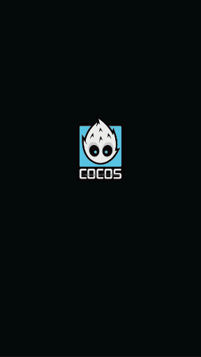


6. 碰撞调用

    - 小鸟脚本修改 BirdControl.ts

    ```ts{12-14，24-30}
    import { _decorator, Component, Animation, RigidBody2D, Vec2 } from 'cc';
    import { Contact2DType,BoxCollider2D,Collider2D,IPhysics2DContact} from 'cc';
    const { ccclass, property } = _decorator;

    @ccclass('birdControl')
    export class birdControl extends Component {
        start() {
            let ani = this.getComponent(Animation)
            // 播放
            ani.play()

            // 获取碰撞体组件
            let collider = this.node.getComponent(Collider2D);
            collider.on(Contact2DType.BEGIN_CONTACT, this.onBeginContact, this);
        }

        // 飞
        fly(){
            let RigidBody = this.getComponent(RigidBody2D);
            // 设置向上的除速度
            RigidBody.linearVelocity = new Vec2(0,5);
        }

        onBeginContact(self: Collider2D, other: Collider2D) {
            if(other.tag === 1){
                console.log("加分");
            }else{
                console.log("死亡");
            }
        }
        
    }
    ```
    - 运行结果


        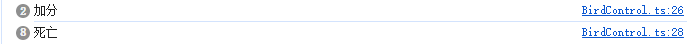


## 3.7 自定义动画脚本

1. 界面

    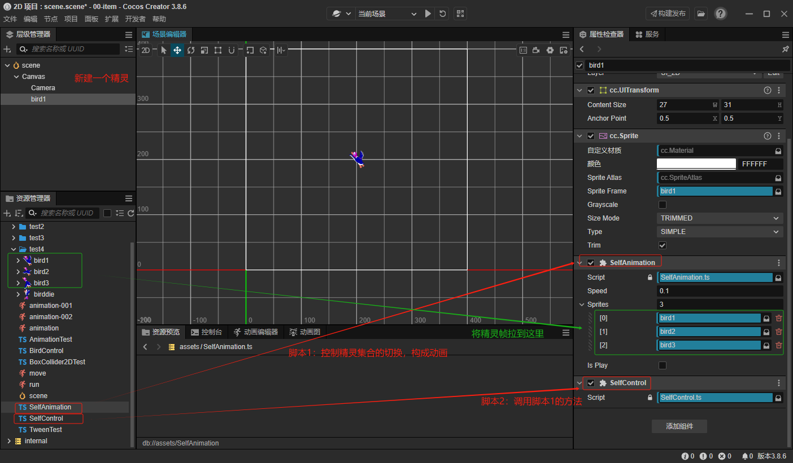

2. 脚本

    - SelfAnimation.ts

        ```ts
        import { _decorator, Component, Node, Sprite, SpriteFrame } from 'cc';
        const { ccclass, property } = _decorator;

        @ccclass('SelfAnimation')
        export class SelfAnimation extends Component {

            // 每秒播放速度
            @property
            speed:number = 0.1;
            // 播放帧数组
            @property([SpriteFrame])
            sprites: SpriteFrame[] = [];
            // 是否播放动画
            @property
            isPlay:boolean = false;
            // 当前播放帧
            index: number = 0;
            // 计时器
            timer: number = 0;

            start() {

            }

            play(){
                this.isPlay = true;
            }
            stop(){
                this.isPlay = false;
            }

            update(deltaTime: number) {
                if(this.isPlay){
                    // 播放动画

                    // 计时器增加
                    this.timer += deltaTime;
                    // 大于当前播放间隔 开始执行
                    if(this.timer > this.speed){
                        this.timer = 0;
                        // 切换帧 0 1 2 0 1 2
                        this.index++;
                        if(this.index >= this.sprites.length){
                            this.index = 0
                        }
                        this.getComponent(Sprite).spriteFrame = this.sprites[this.index];
                    }
                }
            }
        }
        ```
    - SelfControl.ts

        ```ts
        import { _decorator, Component } from 'cc';
        import { SelfAnimation } from './SelfAnimation';
        const { ccclass, property } = _decorator;

        @ccclass('SelfControl')
        export class SelfControl extends Component {
            start() {
                // 调用脚本中的方法
                this.getComponent(SelfAnimation).play()
            }

            update(deltaTime: number) {
                
            }
        }
        ```
3. 运行结果

    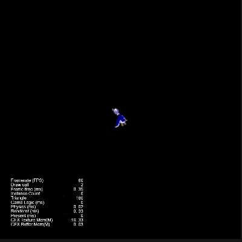
