# 六、其他

## 6.1 tieldmap 瓦片地图

### 6.1.1 tieldmap 下载使用 

1. 下载软件

    - [进入网站](https://www.mapeditor.org/)

    - 下载步骤

        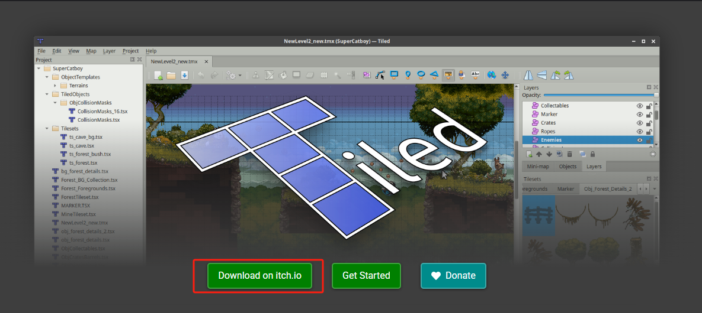

        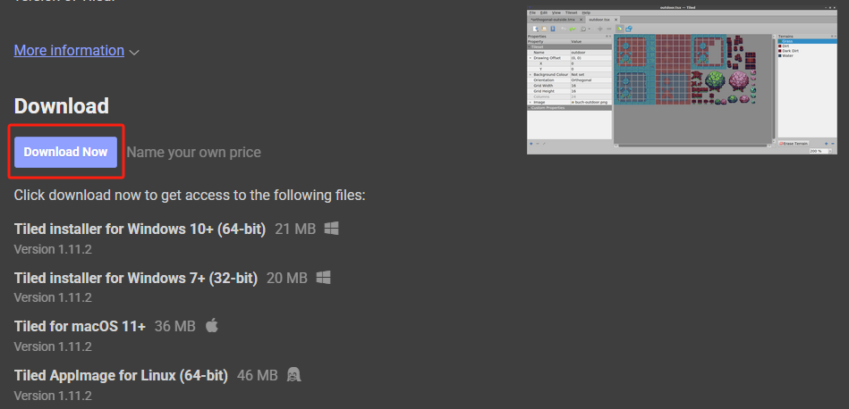

        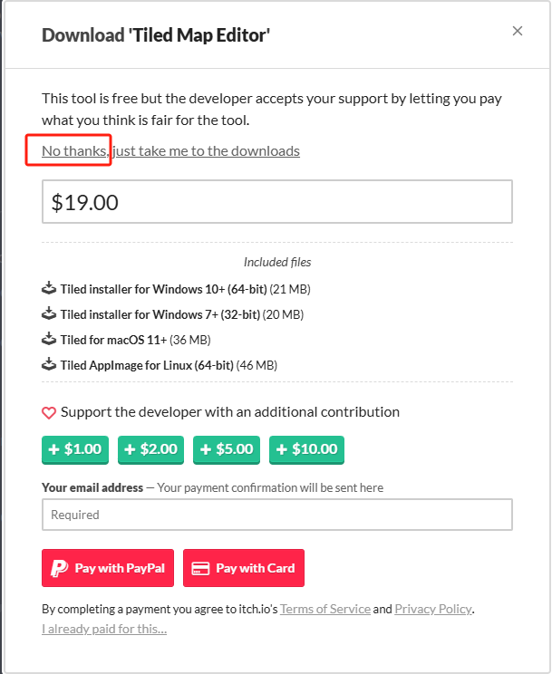

        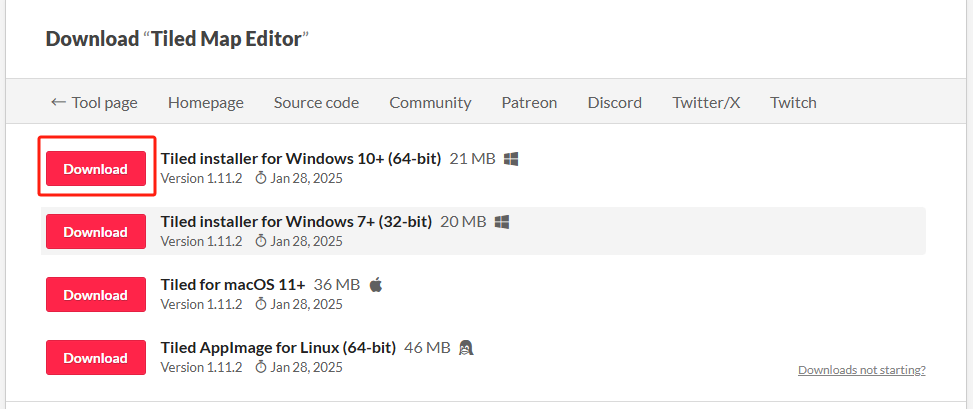

    - 安装后

        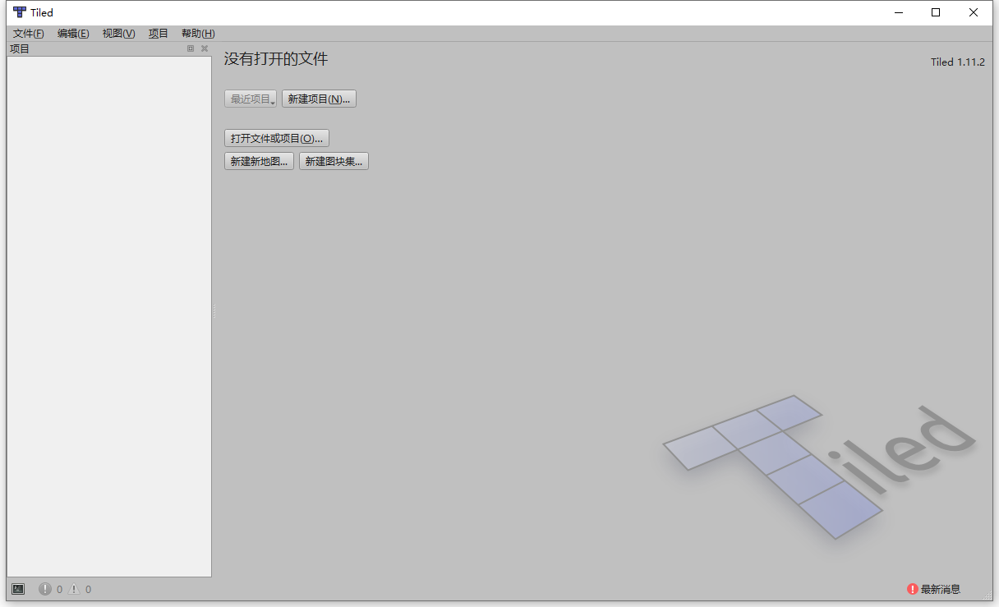

2. 导入图片

    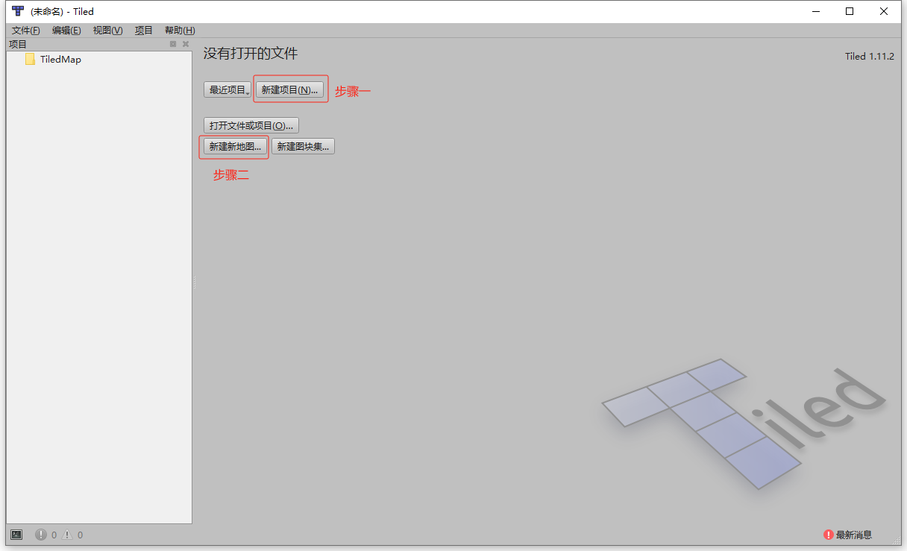

    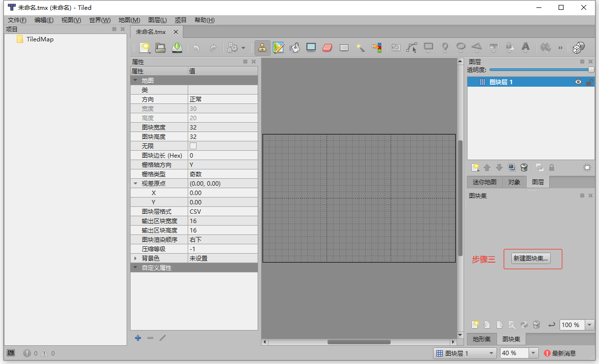

    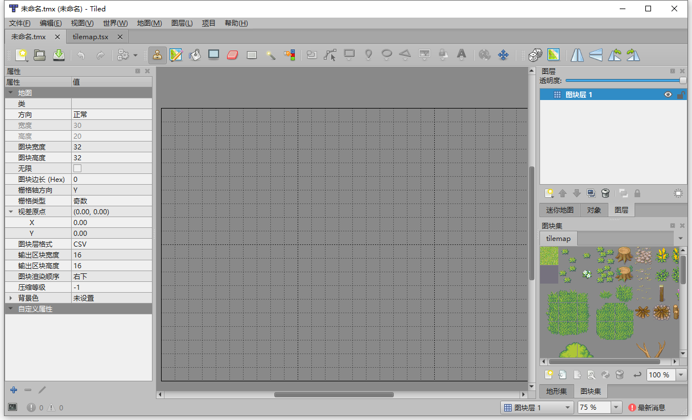

3. 构建地图

    - 新建图块层

        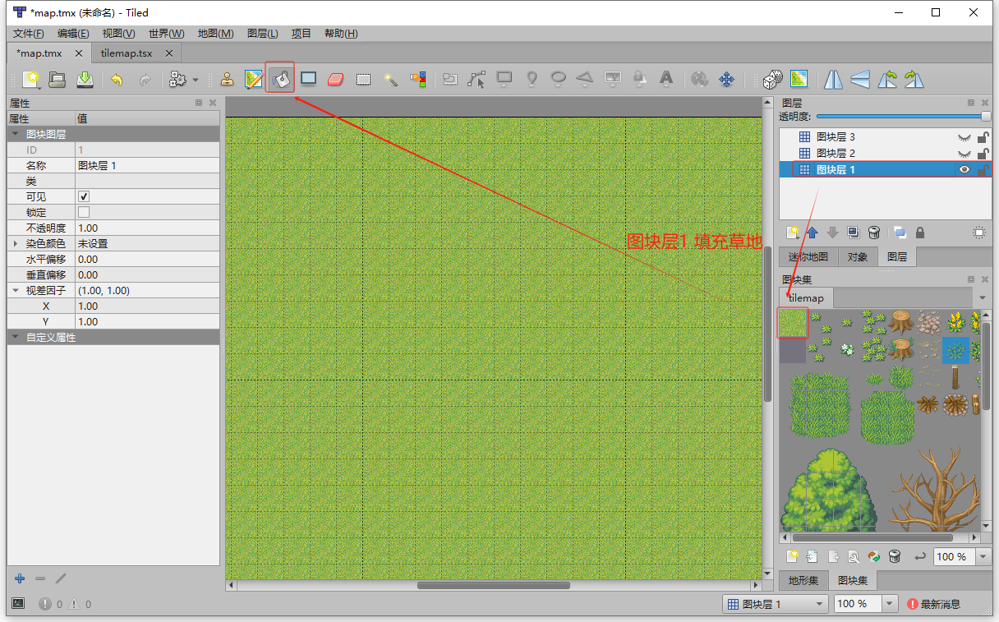

        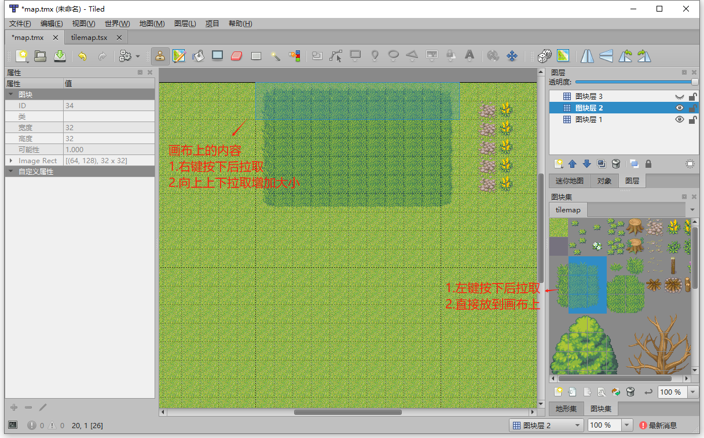

        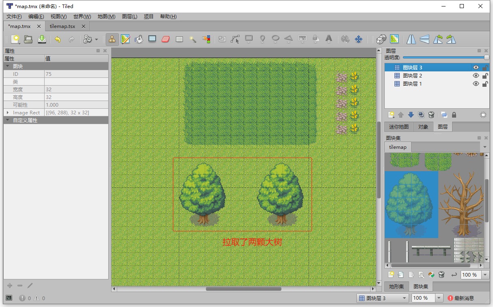

    - 新建对象层(玩家层)

        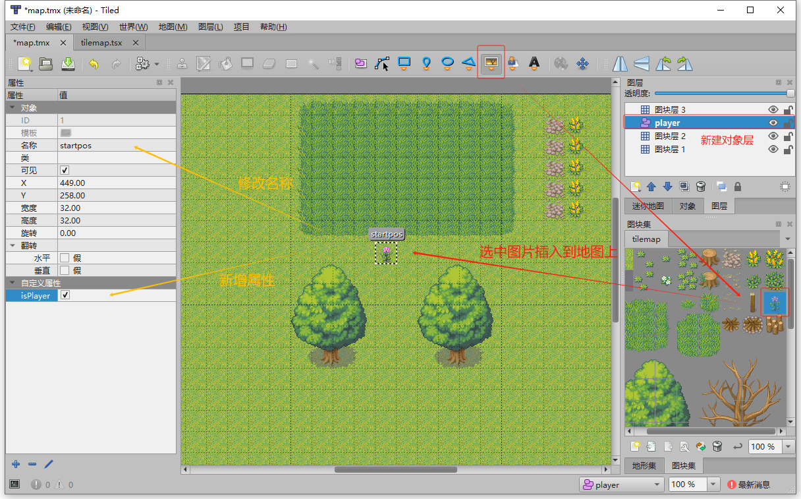

4. 导出内容

    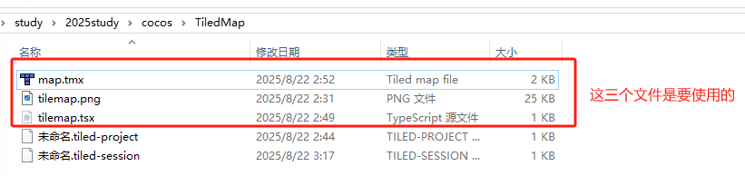

### 6.1.2 导入cocos中使用

1. cocos 新建map文件，导入文件，并布局

    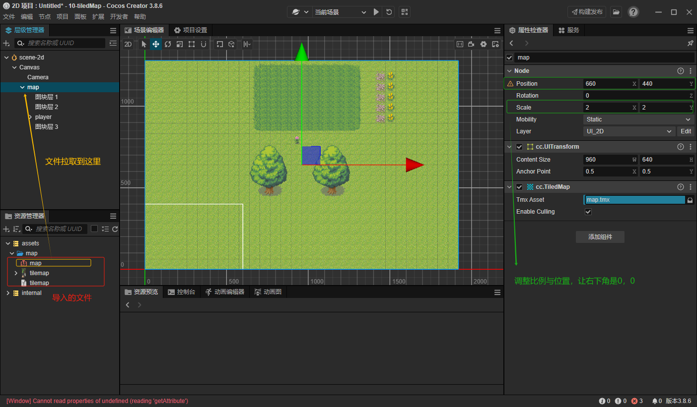

2. 设置对象层

    - 对象层在地图中央

        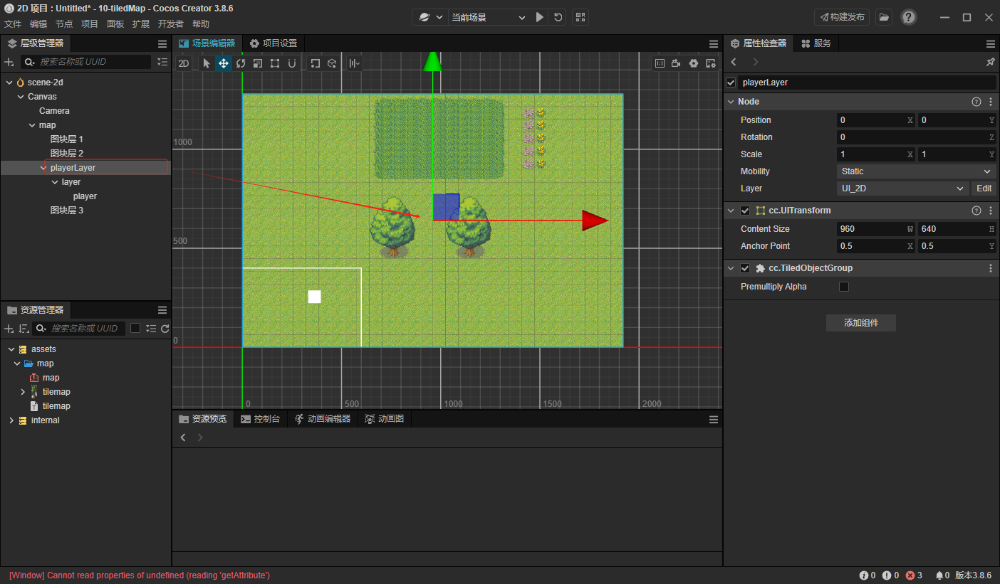
    - layer 世界坐标轴 0,0

        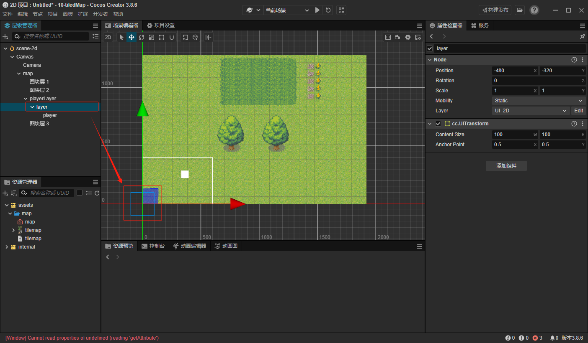
    - 玩家角色超过摄像机中心点

        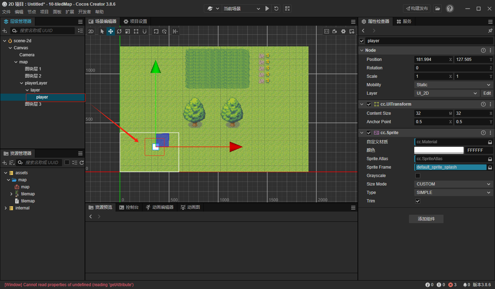

    - 玩家设置为预设体，并删除自身

        

3. 编写脚本

    

### 6.1.3 综合练习-打小鸟

## 6.2 粒子系统

## 6.3 游戏打包

## 6.4 游戏框架

## 6.5 有限状态机

